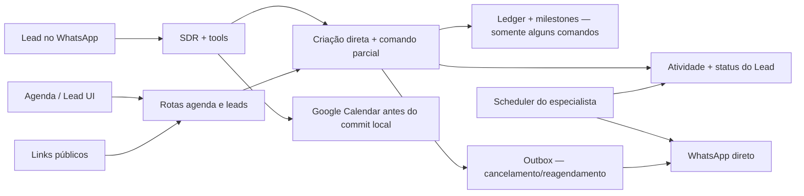
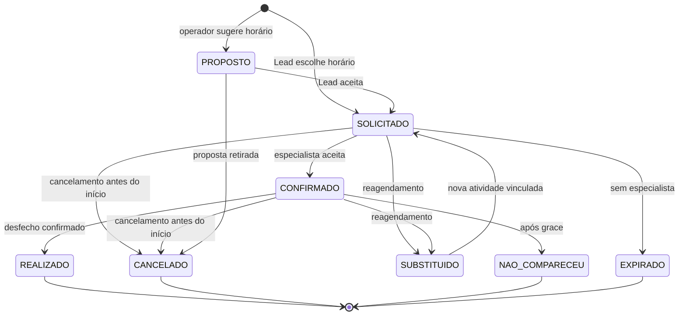

# Auditoria holística da Agenda — AS-IS / TO-BE

## 1. Identificação

- Sistema: Elyon CRM — domínio Agenda/Atendimento.
- Baseline auditado: `origin/main@517cd7f57460f745800c0ead458ead0fba8fb169`, o mesmo SHA observado em produção.
- Data: 2026-08-01.
- Profundidade: profunda, não destrutiva.
- Objetivo: modelar todas as situações relevantes de um agendamento, confrontar o modelo com código, testes e comportamento real e produzir um plano único de implementação.
- Fora do escopo desta auditoria: alterar código, reescrever dados históricos, reativar efeitos ou habilitar no-show.

## 2. Veredito executivo

O Elyon possui uma fundação tecnicamente forte para **três comandos específicos** — cancelar, reagendar e registrar no-show — com transação serializável, idempotência, fencing, ledger e milestones. Porém, ainda não possui um **domínio de agendamento completo e único**. Criação, aprovação, confirmação do Lead, confirmação do especialista, proposta de horário, conclusão, jobs, WhatsApp e Google Calendar seguem caminhos parcialmente independentes.

O incidente real confirmou a principal lacuna: um atendimento das 16:00 foi cancelado às 18:36. Houve exatamente um comando e um milestone, sem duplicidade, mas a transição era semanticamente inválida. A infraestrutura executou corretamente uma regra de negócio incompleta.

Direção recomendada: não continuar corrigindo telas ou tools isoladamente. Primeiro fechar a máquina de estados, invariantes temporais e matriz de situações; depois fazer todos os produtores passarem por um único agregado de Agenda e mover efeitos externos para outbox durável.

Confiança geral: **alta** para código e incidente; **média** para frequência operacional, pois a produção possui somente cinco agendamentos nos últimos 90 dias.

## 3. Decisões executivas necessárias

1. Até quanto tempo antes do início Lead, especialista e operador podem cancelar: até o instante inicial ou um cutoff anterior?
2. Qual janela pós-horário deve permitir classificar `REALIZADO` ou `NAO_COMPARECEU`?
3. A confirmação do Lead continua sendo uma dimensão separada quando o próprio Lead escolheu o horário pelo WhatsApp?
4. Google Calendar será por tenant/especialista ou continuará sendo um calendário global da plataforma?
5. Quando responsável e fallback recusarem, o atendimento expira, vai para fila operacional ou recebe novo horário?

Enquanto essas decisões não forem formalizadas, a recomendação conservadora é: cancelar/reagendar somente antes do início; após o início, permitir apenas desfecho ou correção administrativa auditada.

## 4. Registro resumido de evidências

| ID | Classe | Evidência | Fonte | Confiança |
|---|---|---|---|---|
| EV-01 | Fato | Cancelar, reagendar e no-show passam por transação serializável, advisory lock, versão, ledger e milestone. | `pacotes/backend/src/servicos/coerencia-agenda-estado.ts@origin/main:156-301` | Alta |
| EV-02 | Fato | O validador exige novo horário futuro no reagendamento, mas não exige que o compromisso original ainda esteja no futuro para cancelar ou reagendar. | `coerencia-agenda-estado.ts@origin/main:72-89,190-200` | Alta |
| EV-03 | Fato | A tool de cancelamento busca qualquer atividade pendente/confirmada, sem filtro `agendadoPara > agora`. | `pacotes/backend/src/ferramentas/sdr-tools-agents.ts@origin/main:1217-1227` | Alta |
| EV-04 | Fato | O incidente real persistiu cancelamento 2h36 após o início, com um ledger e um milestone, sem duplicidade. | Consulta agregada de produção em 2026-08-01 | Alta |
| EV-05 | Fato | A interpretação temporal da criação rejeita data inválida, ambígua ou passada. | `pacotes/backend/src/servicos/agenda-temporal.ts@origin/main:76-100` | Alta |
| EV-06 | Fato | Aprovar, confirmar publicamente, propor horário, completar e excluir atividade ainda escrevem diretamente em `Atividade`, fora do agregado de comandos. | `pacotes/backend/src/rotas/agenda.ts@origin/main:274-355,464-500`; `pacotes/backend/src/rotas/leads.ts@origin/main:1690-1734,1982-2041` | Alta |
| EV-07 | Fato | A UI oferece Cancelar, Reagendar e Propor Horário sem considerar estado terminal ou fase temporal. | `pacotes/frontend/src/paginas/Agenda.tsx@origin/main:586-603` | Alta |
| EV-08 | Fato | O Google Calendar pode declarar o horário livre quando a API falha. | `pacotes/backend/src/servicos/google-calendar.ts@origin/main:240-275` | Alta |
| EV-09 | Fato | O evento Google é criado antes da persistência local e não existem operações de update/delete do evento no código. | `sdr-tools-agents.ts@origin/main:1008-1075`; busca por `events.update/delete` | Alta |
| EV-10 | Fato | Configuração de Calendar é global por variáveis de ambiente, não por tenant ou especialista. | `pacotes/backend/src/servicos/google-calendar.ts@origin/main:54-88` | Alta |
| EV-11 | Fato | Scheduler do especialista roda no worker a cada minuto e executa convite, lembrete e cutoff em sequência. | `pacotes/backend/src/servicos/scheduler-confirmacao-corretor.ts@origin/main:8-51`; `worker.ts@origin/main:175-180` | Alta |
| EV-12 | Fato | Remanejamento persiste primeiro e envia WhatsApp diretamente depois; envio e marcação não são atômicos nem passam pela outbox da Agenda. | `pacotes/backend/src/servicos/remanejamento-corretor.ts@origin/main:62-135` | Alta |
| EV-13 | Fato | A outbox existente cobre notificações anexadas aos comandos de cancelar/reagendar e trata entrega ambígua como reconciliação. | `pacotes/backend/src/servicos/efeitos-agenda-outbox.ts@origin/main:15-106` | Alta |
| EV-14 | Fato | A suíte de baseline cobre extensamente idempotência, concorrência, fencing e rollback, mas não cobre cancelamento/reagendamento do compromisso vencido nem o ciclo completo de conclusão. | `pacotes/backend/test/baseline/agenda-commercial.integration.test.ts@origin/main` | Alta |
| EV-15 | Fato | Produção: 5 agendamentos em 90 dias; 1 cancelamento tardio; 0 realizados; 0 no-shows; 0 múltiplos futuros ativos; 0 divergências atuais de status medidas. | Consulta agregada de produção em 2026-08-01 | Alta |
| EV-16 | Inferência | Zero `REALIZADO` e zero `NAO_COMPARECEU` indicam que o ciclo pós-atendimento ainda não é usado de forma operacional. A amostra é pequena. | EV-15 | Média |
| EV-17 | Fato | Documentação declarou jobs e handoff concluídos, mas o desenho anterior dependia de rotas manuais; o scheduler persistente só foi incorporado depois. | `docs/planos/PLAN_IMPLEMENTACAO_HANDOFF_ESPECIALISTA_POR_CAMPANHA.md`; histórico Git/PR #92 | Alta |

## 5. AS-IS

### Capacidades presentes

- Interpretação segura de data/hora na criação pelo agente.
- Responsável e fallback por campanha.
- Convite, lembrete, recusa, cutoff e remanejamento de especialista.
- Confirmação semântica correta ao Lead depois do aceite do especialista.
- Cancelamento via agente com tool real e confirmação somente após sucesso.
- Cancelamento/reagendamento/no-show com ledger, milestone, concorrência e replay.
- Piloto tenant-safe, métricas sem PII, cutoff e rollback.

### Maturidade por domínio

| Domínio | Nota 0–5 | Confiança | Justificativa |
|---|---:|---|---|
| Modelo de ciclo de vida | 2 | Alta | Estados existem, mas misturam agendamento, confirmação do Lead e atribuição do especialista. |
| Consistência dos três comandos centrais | 4 | Alta | Transação, lock, versão, idempotência, fencing e testes PostgreSQL reais. |
| Regras temporais | 2 | Alta | Criação é segura; cancelar/reagendar/confirmar/concluir não compartilham invariantes completas. |
| Handoff do especialista | 3 | Alta | Scheduler e fallback funcionam, porém histórico e efeitos ainda são parcialmente imperativos. |
| Integrações/efeitos | 2 | Alta | Outbox é boa, mas não cobre todos os envios e Calendar. |
| UX operacional | 2 | Alta | Agenda permite ações que o backend deveria negar e não oferece desfecho completo. |
| Observabilidade | 3 | Média | Métricas do piloto e comandos existem; faltam métricas da jornada e SLA de integrações. |
| Testes | 3 | Alta | Profundos em concorrência; incompletos na matriz funcional e temporal ponta a ponta. |
| Operação/rollback | 4 | Alta | Feature flags, isolamento e rollback provaram funcionar no incidente. |

## 6. Matriz holística de situações

Legenda: `OK` coberto; `PARCIAL` existe com lacuna; `AUSENTE` não localizado; `INSEGURO` permite resultado incorreto.

| # | Situação | Comportamento esperado TO-BE | AS-IS |
|---:|---|---|---|
| 1 | Lead informa data/hora futura válida | Criar solicitação durável e aguardar especialista | PARCIAL — criação funciona; efeito externo pode preceder commit |
| 2 | Data ambígua, inválida ou passada | Pedir esclarecimento sem reservar | OK na tool principal |
| 3 | Horário fora do expediente | Recusar e sugerir slots válidos | PARCIAL — geração de slots respeita expediente; criação direta não aplica a mesma regra |
| 4 | Conflito com outro compromisso local | Não reservar e oferecer alternativas | AUSENTE no caminho principal |
| 5 | Google indisponível ao consultar agenda | Estado degradado explícito; nunca presumir livre | INSEGURO — fail-open como disponível |
| 6 | Campanha sem especialista elegível | Não confirmar; orientar operação | OK |
| 7 | Mensagem/tool repetida | Um agendamento e um conjunto de efeitos | PARCIAL — DB tem chaves; Calendar pode ser criado antes da deduplicação local |
| 8 | Já existe agendamento futuro | Reagendar o vigente ou pedir escolha explícita | PARCIAL |
| 9 | Solicitação registrada | Informar “aguardando especialista” | OK |
| 10 | Convite T-120 | Um convite durável ao responsável | PARCIAL — scheduler existe; envio direto pode ficar ambíguo |
| 11 | Lembrete T-90 | Um lembrete | PARCIAL — flag evita repetição nominal, mas send-before-marker pode duplicar em queda |
| 12 | Responsável aceita no prazo | Confirmar atribuição e notificar Lead | PARCIAL — estado existe; notificação não é toda durável |
| 13 | Responsável recusa | Selecionar fallback diferente | OK na regra principal |
| 14 | Responsável expira no cutoff | Selecionar fallback diferente | OK na regra principal |
| 15 | Responsável e fallback indisponíveis | Fila/alerta/expiração conforme decisão de negócio | PARCIAL — retorna `SEM_SUBSTITUTO`; destino final precisa ser definido |
| 16 | Especialista tenta aceitar após cutoff | Recusar aceite tardio sem reassumir | OK |
| 17 | Lead pergunta data/responsável atual | Responder a partir do agregado vigente | PARCIAL — não há tool dedicada de consulta da Agenda |
| 18 | Lead cancela antes do início | Cancelar uma vez, notificar e auditar | OK no comando; efeitos estavam em piloto |
| 19 | Lead repete cancelamento | Responder idempotentemente sobre o mesmo compromisso | PARCIAL — fallback pode escolher qualquer cancelamento mais recente |
| 20 | Lead cancela depois do início | Recusar cancelamento; oferecer desfecho | INSEGURO — incidente reproduzido em produção |
| 21 | Reagendamento antes do início | Encerrar original como substituído; criar nova solicitação e reiniciar aceite | PARCIAL — original vira cancelado; ciclo externo é incompleto |
| 22 | Reagendamento depois do início | Recusar; abrir recuperação vinculada se necessário | INSEGURO — só valida que o novo horário é futuro |
| 23 | Operador propõe novo horário | Persistir proposta separada; só reagendar após aceite | PARCIAL — muda status/descrição, mas não modela a proposta |
| 24 | Novo horário conflita | Recusar antes de criar substituta | AUSENTE no comando central |
| 25 | Aprovação de agendamento vencido/cancelado | Default-deny | INSEGURO — rota aprova diretamente |
| 26 | Confirmação pública de compromisso vencido | Default-deny e invalidar token | PARCIAL/INSEGURO |
| 27 | Atendimento começou | Expor somente ações de desfecho | AUSENTE como fase explícita ou ações permitidas pelo servidor |
| 28 | Atendimento realizado | Comando transacional, milestone, resultado comercial | PARCIAL — update direto, sem ledger/milestone |
| 29 | Lead não compareceu | Após grace, comando e milestone explícitos | PARCIAL — núcleo existe; piloto automático está desligado |
| 30 | Especialista não compareceu | Registrar parte ausente e política de recuperação | AUSENTE nos produtores atuais; tipo existe no comando |
| 31 | Resultado não informado | Fila operacional e alerta de “desfecho pendente” | AUSENTE |
| 32 | Cancelar/reagendar evento Google | Sincronizar por outbox e registrar resultado | AUSENTE |
| 33 | Falha após envio WhatsApp | Reconciliação, sem reenvio cego | OK somente na outbox de cancelamento/reagendamento |
| 34 | Falha após criar evento Google e antes do DB | Compensar ou reconciliar evento órfão | AUSENTE |
| 35 | Duas ações simultâneas | Um vencedor, demais recebem conflito estável | OK nos comandos; PARCIAL nas rotas diretas |
| 36 | Token antigo após reagendamento/terminal | Revogar/expirar e negar | PARCIAL — token permanece no registro terminal |
| 37 | Exclusão de atividade | Proibir hard delete de fatos de Agenda; usar anulação auditada | INSEGURO — rota de delete físico existe |
| 38 | Tenant/timezone diferentes | Timezone confiável por tenant, UTC canônico | PARCIAL — criação principal fixa São Paulo; Calendar é global |
| 39 | Mudança de horário de verão | Rejeitar lacunas/ambiguidades e preservar zona | PARCIAL — parser cobre parte; modelo não guarda timezone do compromisso |
| 40 | Auditoria ponta a ponta | Timeline única: quem, quando, estado anterior/novo e efeitos | PARCIAL — dados espalhados entre atividade, logs, ledger e auditoria |

## 7. Achados priorizados

### [Crítico] Invariantes temporais não são centrais

- Impacto: o sistema pode alterar retroativamente compromissos vencidos e comunicar uma realidade comercial falsa.
- Evidência: EV-02, EV-03 e EV-04.
- Aceite: cancelar, reagendar, aprovar e confirmar depois do início retornam reason code estável, sem mutação, milestone ou efeito; somente desfecho/correção auditada permanece disponível.

### [Alto] Existem múltiplos escritores do estado de Agenda

- Impacto: a garantia de transação/idempotência do núcleo não vale para todo o produto.
- Evidência: EV-06.
- Aceite: nenhuma rota, tool ou job altera campos de ciclo de vida diretamente; todos chamam o mesmo serviço de domínio.

### [Alto] Efeitos externos não compartilham a mesma garantia de durabilidade

- Impacto: evento Google órfão, WhatsApp duplicado ou estado local divergente do provedor.
- Evidência: EV-08 a EV-13.
- Aceite: toda chamada externa nasce de intenção transacional em outbox; confirmação/reconciliação tem estado e métricas próprias.

### [Alto] O modelo mistura três dimensões

- Dimensões hoje misturadas: ciclo do atendimento, aceite do Lead e atribuição do especialista.
- Impacto: `PENDENTE`, `CONFIRMADO`, `RECUSADO` e `REMANEJADO` significam coisas diferentes conforme a tela.
- Aceite: ciclo principal, atribuição e presença possuem estados e transições separados, ligados por invariantes.

### [Alto] O pós-atendimento não está operacionalmente fechado

- Evidência: update direto de `REALIZADO`, nenhuma ocorrência real de realizado/no-show e ausência de fila de desfecho.
- Impacto: Agenda acumula fatos sem resultado comercial confiável e impede métricas de conversão.
- Aceite: todo compromisso vencido entra em janela de desfecho; `REALIZADO`, `NO_SHOW_LEAD`, `NO_SHOW_ESPECIALISTA` ou correção auditada são obrigatórios.

### [Médio] UI e agente não recebem ações permitidas do domínio

- Impacto: ações inválidas continuam visíveis e o modelo precisa inferir regra temporal.
- Aceite: API retorna `allowedActions` e `temporalPhase`; UI e tools obedecem ao contrato, mantendo validação autoritativa no backend.

## 8. TO-BE

### 8.1 Estados propostos

Separar três eixos:

1. **Ciclo do atendimento:** `PROPOSTO`, `SOLICITADO`, `CONFIRMADO`, `REALIZADO`, `CANCELADO`, `NAO_COMPARECEU`, `EXPIRADO`, `SUBSTITUIDO`.
2. **Atribuição do especialista:** `PENDENTE`, `ACEITO`, `RECUSADO`, `EXPIRADO`, `SUBSTITUIDO`, com histórico de tentativas.
3. **Fase temporal calculada:** `FUTURO`, `EM_JANELA`, `VENCIDO`, derivada do relógio do PostgreSQL e nunca usada como texto livre do modelo.

`EM_ATENDIMENTO` só deve virar estado persistido se houver um evento real de início/check-in. Caso contrário, use fase temporal calculada para evitar transições artificiais por relógio.

### 8.2 Invariantes obrigatórias

- Apenas o agregado de Agenda altera ciclo de vida, estado do Lead, atribuição, ledger e milestones.
- O relógio autoritativo é o PostgreSQL; comandos carregam instante observado, mas a transação valida contra `CURRENT_TIMESTAMP`.
- Cancelar, reagendar, aprovar ou confirmar exigem compromisso ainda futuro e estado permitido.
- Reagendamento cria substituta; a original fica `SUBSTITUIDO`, não `CANCELADO`.
- Após o início, apenas `REALIZAR`, `REGISTRAR_NO_SHOW` ou `CORRIGIR_DESFECHO` são permitidos.
- Correção administrativa exige papel autorizado, motivo, estado anterior/novo e milestone; nunca hard delete.
- Toda notificação WhatsApp e operação Calendar passa por outbox com idempotency key.
- Calendar indisponível nunca significa “livre”; significa `DISPONIBILIDADE_DESCONHECIDA`.
- API retorna `allowedActions`, `reasonCodes` e fase temporal; UI nunca inventa permissões.
- Tokens públicos possuem propósito, expiração, uso/revogação e vínculo à versão da atividade.

### 8.3 Limite de componentes

- `AgendaCommandService`: única entrada de mutação.
- `AgendaPolicy`: máquina de estados, invariantes temporais e ações permitidas.
- `AgendaAssignmentService`: histórico de responsável/fallback e SLA.
- `AgendaEffectOutbox`: WhatsApp, Calendar e notificações internas.
- `AgendaOutcomeWorker`: fila de desfecho pendente; no-show automático continua feature-gated.
- Adaptadores (`API`, `UI`, `Agent tools`, `public token`, `scheduler`) apenas traduzem intenção para comandos.

## 9. Matriz de lacunas

| ID | AS-IS | TO-BE | Severidade | Esforço | Dependência | Aceite |
|---|---|---|---|---|---|---|
| GAP-01 | Cancelamento/reagendamento de vencido permitido | Guard temporal central | Crítico | P | Decisão de cutoff | Testes de fronteira + incidente recusado |
| GAP-02 | Escritas diretas em várias rotas/jobs | Um command service | Alto | G | GAP-01 | Busca estática sem mutações diretas do ciclo |
| GAP-03 | Estados sobrepostos | Três eixos explícitos | Alto | G | ADR de estados | Matriz sem transição ambígua |
| GAP-04 | Calendar antes do commit e sem update/delete | Outbox + sync estruturado | Alto | G | GAP-02 | Criar/reagendar/cancelar reconciliáveis |
| GAP-05 | WhatsApp direto em handoff/jobs | Outbox comum | Alto | M | GAP-02 | Zero send-before-marker |
| GAP-06 | Conclusão direta e pós-evento incompleto | Comandos de desfecho | Alto | M | GAP-03 | Todo vencido tem desfecho/pendência |
| GAP-07 | UI oferece ações inválidas | `allowedActions` do servidor | Médio | M | GAP-01/02 | Ação inválida invisível e negada no backend |
| GAP-08 | Tokens sem ciclo explícito | Token com expiração/revogação/versão | Médio | M | GAP-03 | Token terminal não altera estado |
| GAP-09 | Calendar global e fail-open | Integração por tenant/especialista, degraded explícito | Alto | G | Decisão executiva | Conflito e falha diferenciados |
| GAP-10 | Testes profundos, matriz funcional incompleta | Contract/scenario suite | Alto | M | Todos | 100% dos cenários críticos automatizados |

## 10. Roadmap de implementação

### Onda 0 — Contenção e contrato mínimo

| Iniciativa | Resultado | Owner funcional | Esforço | Indicador | Exit criteria |
|---|---|---|---:|---|---|
| Manter efeitos/no-show desligados | Evita amplificar transição incorreta | Operação/SRE | P | flags off | Métricas confirmam ambos disabled |
| Guard temporal central | Bloqueia cancelar/reagendar/aprovar/confirmar vencidos | Backend | P | `invalid_transition_total` | Incidente e limites T-1ms/T/T+1ms verdes |
| Tool/UI com atividade futura e ações permitidas | Evita seleção de compromisso vencido | Backend + Frontend/IA | P | rejeições por origem | Tool nunca escolhe vencido; botões são coerentes |
| Correção administrativa do caso real | Preserva trilha sem apagar fatos | Operação + Produto | P | correções auditadas | Estado correto definido e milestone de correção |

### Onda 1 — Fundação do domínio

| Iniciativa | Resultado | Owner funcional | Esforço | Dependências | Exit criteria |
|---|---|---|---:|---|---|
| ADR da máquina de estados e cutoffs | Contrato aprovado antes do código | Produto + Arquitetura | P | 5 decisões executivas | Matriz assinada e reason codes fechados |
| `AgendaPolicy` + `allowedActions` | Uma regra para API, UI, IA e jobs | Backend | M | ADR | Teste por estado × ação × fase temporal |
| Migrar todos os escritores para comandos | Autoridade única | Backend | G | AgendaPolicy | Nenhuma escrita direta em campos protegidos |
| Comandos `SOLICITAR`, `ACEITAR`, `PROPOR`, `REALIZAR`, `CORRIGIR` | Ciclo completo | Backend | G | Estados | Ledger/milestone/Lead atômicos |
| Proibir hard delete de Agenda | Histórico preservado | Backend | P | Comandos | Somente anulação auditada |

### Onda 2 — Atribuição e efeitos duráveis

| Iniciativa | Resultado | Owner funcional | Esforço | Dependências | Exit criteria |
|---|---|---|---:|---|---|
| Histórico de atribuições | Responsável/fallback sem sobrescrever fatos | Backend/Dados | M | ADR | Cada tentativa e aceite rastreável |
| Outbox comum para WhatsApp | Convite, lembrete, confirmação e remanejamento idempotentes | Backend/Plataforma | M | Command service | Queda em cada fronteira não duplica envio |
| Calendar estruturado por atividade | Event ID, calendário, sync status e versão | Backend/Integrações | M | Decisão Calendar | Sem ID dentro de descrição livre |
| Calendar via outbox | Criar/atualizar/cancelar com reconciliação | Backend/Integrações | G | Modelo estruturado | Zero evento órfão em testes de falha |
| Disponibilidade fail-closed/degradada | Nunca reservar supondo agenda livre | Produto + Backend | P | Decisão de UX | API distingue ocupado/indisponível/desconhecido |

### Onda 3 — Operação, UX e agente

| Iniciativa | Resultado | Owner funcional | Esforço | Dependências | Exit criteria |
|---|---|---|---:|---|---|
| Drawer orientado por `allowedActions` | Operador vê somente ações válidas | Frontend | M | Onda 1 | Testes por estado e fase |
| Timeline unificada | Explica criação, aceite, troca, mensagens e desfecho | Frontend + Backend | M | Ledger/atribuições/outbox | Caso completo auditável em uma tela |
| Tools `consultar`, `cancelar`, `reagendar`, `registrar_desfecho` | IA age sem inferir estado | IA + Backend | M | Onda 1 | Cenários conversacionais sem falsa confirmação |
| Fila de desfecho pendente | Nenhum compromisso vencido fica esquecido | Operação + Backend | M | Comandos de desfecho | SLA e alertas definidos |

### Onda 4 — Validação e retomada do piloto

| Iniciativa | Resultado | Owner funcional | Esforço | Dependências | Exit criteria |
|---|---|---|---:|---|---|
| Suite de 40 cenários | Cobertura da matriz holística | QA + Engenharia | M | Ondas 1–3 | Cenários críticos e concorrentes verdes |
| Shadow/read-only em produção | Detecta decisões que seriam negadas | SRE + Backend | P | Métricas | 48h sem divergência inesperada |
| Reativar somente efeitos no tenant piloto | Validar cancelamento/reagendamento | Operação | P | Gates verdes | 10 efeitos, 3 cancelamentos, 3 reagendamentos, zero duplicidade |
| Avaliar no-show em checkpoint separado | Impede expansão prematura | Produto + Arquitetura | P | Etapa de efeitos aprovada | Nova autorização formal; grace validado |

## 11. Ordem recomendada dos primeiros incrementos

1. Guard temporal central e testes do incidente.
2. `allowedActions` e seleção somente de compromisso futuro na tool.
3. ADR/matriz final aprovada com os cinco pontos executivos.
4. Migrar aprovação, confirmação pública, proposta e conclusão para comandos.
5. Modelar desfecho e impedir hard delete.
6. Unificar efeitos WhatsApp em outbox.
7. Estruturar e sincronizar Google Calendar.
8. Implementar UX/timeline/tools de consulta e desfecho.
9. Rodar suite holística e shadow mode.
10. Reabrir piloto de efeitos; no-show somente depois.

## 12. Métricas de sucesso

| Métrica | Baseline | Meta inicial | Fonte |
|---|---:|---:|---|
| Transições temporais inválidas aplicadas | 1 observada | 0 | Ledger + milestones |
| Efeitos duplicados | 0 no piloto curto | 0 | Outbox/provider IDs |
| Compromissos vencidos sem desfecho após SLA | Não medido | 0 | AgendaOutcomeWorker |
| Divergência CRM × Calendar | Não medido | 0 | Reconciliador Calendar |
| Envios em `DELIVERY_UNKNOWN` sem tratamento | 0 atual | 0 acima do SLA | Outbox |
| Ações negadas por estado/fase/origem | Não medido | Observável, tendência decrescente | Métricas do domínio |
| Confirmação de especialista dentro do SLA | Painel parcial | Meta a definir pelo negócio | Histórico de atribuições |

## 13. Riscos residuais e limitações

- A amostra real ainda é pequena; resultados percentuais não seriam representativos.
- O relatório auditou `origin/main` e o container implantado porque a worktree local está em commit anterior e contém alterações do usuário que foram preservadas.
- Não foi executada a suíte de integração local porque não há configuração explícita de banco isolado na worktree; os testes existentes foram inspecionados estaticamente.
- A política exata de cutoff e desfecho depende das cinco decisões executivas.
- O cancelamento real inválido permanece preservado para auditoria; qualquer correção de dado deve ser comando administrativo explícito, não edição SQL direta.

## 14. Próximo passo

Aprovar a matriz e as cinco decisões executivas. Em seguida, converter Onda 0 e Onda 1 em especificação e tarefas ordenadas. Nenhuma reativação de efeitos ou no-show deve ocorrer antes do gate temporal e da migração dos escritores críticos.
