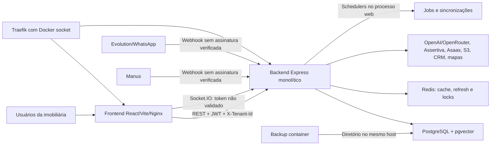
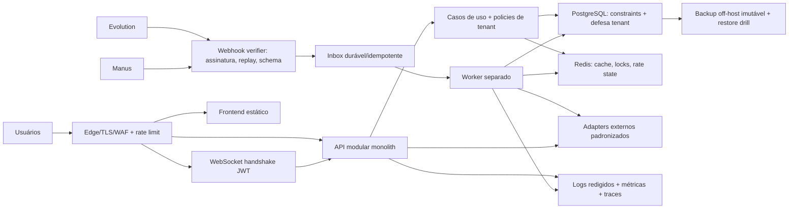

# Auditoria profunda de arquitetura AS-IS / TO-BE — ELYON

## 1. Identificação

| Campo | Valor |
|---|---|
| Sistema | ELYON — CRM imobiliário SaaS multi-tenant com automação e agentes de IA |
| Versão declarada nos pacotes | 0.6.1 |
| Commit auditado | `2d3481f776ecfe61171ab65b659d2d77259e05ea` |
| Data | 12/07/2026 |
| Responsável pela análise | Arquiteto-Chefe (auditoria automatizada assistida por código) |
| Profundidade | Profunda, estática e orientada a risco |
| Objetivo | Reconstruir o AS-IS, definir o TO-BE, priorizar lacunas, decisões e roadmap de transformação |

### Escopo

- Monorepo, backend, frontend e site institucional.
- APIs REST, WebSocket, webhooks, autenticação e isolamento multi-tenant.
- PostgreSQL/Prisma, Redis, dados pessoais, retenção e integrações.
- Agentes de IA, BYOK, guardrails, métricas e fallback.
- Docker Compose, imagens, segredos, deploy, backup e recuperação.
- Testes, CI, documentação, governança e hotspots do Graphify.

### Exclusões e limitações

- Não houve acesso ao ambiente de produção, banco, Redis, logs centralizados, dashboards, custos ou incidentes.
- Não foram executados testes de invasão, carga, failover, restore ou chamadas a provedores externos.
- Testes, typecheck e lint locais não puderam iniciar porque `node_modules` não está instalado; `npm ls --depth=0` reportou dependências ausentes. Isso limita a validação dinâmica, mas não invalida os achados estáticos.
- `docker compose config --quiet` parou na ausência deliberada de `DB_PASSWORD`, demonstrando interpolação fail-closed para essa variável; não foi fornecido arquivo de produção para validar a configuração resolvida.
- Artefatos Graphify foram usados apenas para navegação e identificação de hubs, não como prova única.
- Estado operacional, SLO, RPO, RTO, volumes, latências e custo real permanecem `Desconhecidos`.

## 2. Veredito executivo

**Veredito:** o ELYON tem uma base funcional valiosa e bons controles pontuais, mas está em **NO-GO para expansão multi-tenant ou aumento de exposição externa** até fechar quatro fronteiras críticas: autenticação REST, autenticação WebSocket, autenticidade de webhooks e chave de criptografia de credenciais.

A arquitetura correta para o próximo ciclo não é uma reescrita. O melhor retorno é preservar o monólito modular e endurecer suas fronteiras, separar o ciclo operacional de jobs, tornar recuperação e observabilidade verificáveis e criar gates de entrega orientados aos riscos reais.

### Cinco decisões executivas necessárias

1. Declarar **default deny** para toda rota privada e eliminar tenant informado pelo cliente como fonte de identidade.
2. Suspender ou isolar o WebSocket até autenticar o handshake e autorizar cada evento por tenant/usuário.
3. Exigir assinatura/autenticidade e idempotência para todo webhook antes de processar efeitos ou custos.
4. Tornar `ENCRYPTION_KEY` obrigatória em produção, armazená-la fora do Compose e executar rotação/recriptografia das credenciais BYOK/CRM.
5. Adotar um roadmap de endurecimento do monólito e worker separado; adiar microsserviços/Kubernetes até existir evidência de SLO, escala ou autonomia organizacional que os justifique.

### Confiança

- **Alta** nos achados de autenticação, WebSocket, webhooks, criptografia, CI e divergência documental: evidência direta no código/configuração.
- **Média** nos riscos de continuidade, jobs, observabilidade e manutenibilidade: evidência estática forte, sem comportamento de produção.
- **Baixa** em capacidade, disponibilidade, desempenho e custos: não há baseline operacional fornecido.

### Pontos fortes preserváveis

- Monorepo TypeScript com fronteiras backend/frontend e automação Turbo.
- JWT de curta duração e refresh token rotacionado/persistido no Redis.
- Prisma com relações e índices por tenant em modelos centrais.
- Redis usado para locks de sincronização e serialização do processamento de mensagens.
- BYOK cifrado com AES-256-GCM e rotas autenticadas para configuração.
- Retenção segura capaz de anonimizar PII e remover embeddings.
- Guardrails, structured output, fallback de provedor e testes de agentes em quantidade relevante.
- Timeouts/retries presentes em integrações importantes, embora não uniformes.

## 3. Drivers, restrições e premissas

| ID | Tipo | Descrição | Métrica/critério | Fonte | Status |
|---|---|---|---|---|---|
| DR-01 | Objetivo | Escalar captação e operação comercial por imobiliária | Resultado comercial por tenant; meta real a confirmar | [README_PROJETO.md](../../README_PROJETO.md#L34) | Hipótese documental |
| DR-02 | Atributo | Isolamento forte entre imobiliárias | 0 acessos cross-tenant; 100% das rotas privadas cobertas | [README.md](../../README.md#L21) | Obrigatório |
| DR-03 | Atributo | Proteção de PII imobiliária e de conversas | 0 PII bruta em logs; retenção testada; acesso rastreável | Schema e política de retenção | Obrigatório |
| DR-04 | Atributo | Continuidade do atendimento WhatsApp/IA | SLO, RPO e RTO a definir | Fluxo de negócio documentado | Desconhecido |
| DR-05 | Atributo | Controle de custo de IA e dados enriquecidos | Custo por conversa/captação, budget e alertas | Métricas de agentes existentes | Parcial |
| DR-06 | Restrição | Operação atual em VPS + Docker Compose | Evoluir incrementalmente sem replatform prematuro | [README.md](../../README.md#L53) | Confirmado |
| DR-07 | Restrição | Dependência de Evolution, OpenAI/OpenRouter, Manus, Assertiva, Asaas, AWS/S3 e CRM | Timeout, retry, idempotência e observabilidade por provedor | Manifestos e serviços | Confirmado |
| DR-08 | Premissa | Equipe se beneficia mais de simplicidade operacional que de decomposição distribuída | Monólito modular continua deployável | Inferência arquitetural | A validar |
| DR-09 | Desconhecido | Carga, tenants ativos, mensagens/dia, latência e saturação | Baseline de 30 dias | Não fornecido | Aberto |
| DR-10 | Desconhecido | RPO/RTO, criticidade horária, janela de manutenção e custo de indisponibilidade | Decisão executiva | Não fornecido | Aberto |

## 4. Registro de evidências

| ID | Classificação | Evidência/observação | Fonte | Confiança |
|---|---|---|---|---|
| EV-01 | Fato | O servidor monta rotas de negócio diretamente, sem middleware global de autenticação. | [servidor.ts](../../pacotes/backend/src/servidor.ts#L141) | Alta |
| EV-02 | Fato | `getTenantId` aceita `req.tenantId`, header `x-tenant-id` e query `tenantId`. | [tenant.ts](../../pacotes/backend/src/utils/tenant.ts#L3) | Alta |
| EV-03 | Fato | Heurística estática encontrou 39 arquivos de rota/279 handlers; apenas 10 arquivos referenciam middleware auth e 26 aceitam fallback de tenant. | Inventário local de 12/07/2026 | Média-alta |
| EV-04 | Fato | Rotas de clientes leem e alteram PII usando tenant proveniente do request, sem middleware auth. | [clientes.ts](../../pacotes/backend/src/rotas/clientes.ts#L9) | Alta |
| EV-05 | Fato | Rotas de leads incluem criação, leitura, atualização, exclusão e ações de CRM sem middleware auth no módulo. | [leads.ts](../../pacotes/backend/src/rotas/leads.ts#L40) | Alta |
| EV-06 | Fato | O WebSocket contém `TODO: Validar token JWT` e aceita qualquer `tenantId`, entrando na sala correspondente. | [websocket.ts](../../pacotes/backend/src/servicos/websocket.ts#L38) | Alta |
| EV-07 | Fato | Eventos WebSocket atualizam alertas por ID sem validar ownership ou identidade. | [websocket.ts](../../pacotes/backend/src/servicos/websocket.ts#L77) | Alta |
| EV-08 | Fato | O webhook Evolution processa `instance`/payload sem validar assinatura ou segredo. | [webhook.ts](../../pacotes/backend/src/rotas/webhook.ts#L1475) | Alta |
| EV-09 | Fato | `CONNECTION_UPDATE` do webhook pode alterar status da sessão derivada do payload. | [webhook.ts](../../pacotes/backend/src/rotas/webhook.ts#L2166) | Alta |
| EV-10 | Fato | O webhook Manus localiza e atualiza pesquisas por `taskId` sem autenticar a origem. | [webhook-manus.ts](../../pacotes/backend/src/rotas/webhook-manus.ts#L55) | Alta |
| EV-11 | Fato | Criptografia usa chave default pública quando `ENCRYPTION_KEY` não existe. | [crypto.ts](../../pacotes/backend/src/lib/crypto.ts#L13) | Alta |
| EV-12 | Fato | `docker-compose.yml` não injeta `ENCRYPTION_KEY`; as declarações de secrets existem, mas DB/JWT/Redis continuam vindo de environment interpolation. | [docker-compose.yml](../../docker-compose.yml#L7), [docker-compose.yml](../../docker-compose.yml#L67) | Alta |
| EV-13 | Fato | Backup é gravado em `./backups`, no mesmo host operacional. | [docker-compose.yml](../../docker-compose.yml#L266) | Alta |
| EV-14 | Fato | Health HTTP responde `OK` sem verificar PostgreSQL, Redis ou provedores. | [servidor.ts](../../pacotes/backend/src/servidor.ts#L128) | Alta |
| EV-15 | Fato | Deploy documentado executa rebuild seguido de `down`/`up`; não há rollback transacional comprovado. | [deploy.sh](../../scripts/deploy.sh#L108) | Alta |
| EV-16 | Fato | O CI é acionado apenas por alterações backend e coleta cobertura somente em `src/agentes`. | [ci-backend.yml](../../.github/workflows/ci-backend.yml#L3), [ci-backend.yml](../../.github/workflows/ci-backend.yml#L48) | Alta |
| EV-17 | Fato | Foram encontrados 67 testes backend, fortemente concentrados em agentes, e nenhum teste frontend. | Inventário local de 12/07/2026 | Alta |
| EV-18 | Fato | Código registra telefone, nome, conteúdo de mensagem, dados estruturados e raciocínio em logs. | [webhook.ts](../../pacotes/backend/src/rotas/webhook.ts#L1584), [orchestrator.ts](../../pacotes/backend/src/agentes/orchestrator.ts#L653) | Alta |
| EV-19 | Fato | Há 388 arquivos TS/TSX, ~108 mil linhas e diversos arquivos entre 1.700 e 2.300 linhas. | Inventário local de 12/07/2026 | Alta |
| EV-20 | Fato | Graphify encontrou 2.978 nós, 6.050 links e hubs em API frontend, orquestrador, Redis, respostas e mapa. | [graph.json](../../graphify-out/graph.json), [.graphify_analysis.json](../../graphify-out/.graphify_analysis.json) | Média |
| EV-21 | Fato | A política e o código implementam anonimização e remoção opcional de embeddings. | [POLITICA_RETENCAO_SEGURA_LEADS.md](../politicas/POLITICA_RETENCAO_SEGURA_LEADS.md), [retencao-segura.ts](../../pacotes/backend/src/utils/retencao-segura.ts#L30) | Alta |
| EV-22 | Fato | Documentação declara Socket Proxy/secrets e “Produção Segura”, enquanto o Compose monta Docker socket e usa env vars. | [DEPLOY.md](../../DEPLOY.md#L3), [docker-compose.yml](../../docker-compose.yml#L210) | Alta |
| EV-23 | Fato | README, README_PROJETO, pacotes e Dockerfiles discordam sobre versão, Node, Prisma, Vite e provedor de IA. | [README.md](../../README.md#L26), [README_PROJETO.md](../../README_PROJETO.md#L70), [package.json](../../package.json#L1) | Alta |
| EV-24 | Fato | Alguns controles são robustos: JWT curto, refresh Redis, lock Redis, retries CRM/WhatsApp e guardrails testados. | [token.ts](../../pacotes/backend/src/utilitarios/token.ts#L5), [scheduler-sincronizacao-mapa.ts](../../pacotes/backend/src/servicos/scheduler-sincronizacao-mapa.ts#L77) | Alta |

## 5. Arquitetura AS-IS

### 5.1 Contexto e capacidades

O ELYON é uma plataforma SaaS para imobiliárias que combina CRM, mineração/enriquecimento de contatos, campanhas outbound, WhatsApp, agentes de IA, agenda, contratos, billing, integrações e observabilidade específica de IA. O tenant é o principal limite de segurança e governança.

### 5.2 Containers e responsabilidades

### 5.3 Estrutura interna

- **Backend:** monólito modular por pastas (`rotas`, `servicos`, `agentes`, `casos-de-uso`, `jobs`, `ferramentas`, `lib`). A intenção de separação existe, mas arquivos de rota/serviço acumulam orquestração, autorização, acesso a dados e efeitos externos.
- **Frontend:** SPA React organizada por páginas, componentes, serviços e contextos. Algumas páginas excedem 2 mil linhas, aumentando acoplamento de apresentação, estado e regras.
- **Dados:** 38 modelos e 22 enums no Prisma. Tenant aparece explicitamente nos agregados principais; parte dos filhos depende da relação com o pai. Não foi encontrada política RLS nas migrações.
- **IA:** orquestrador, agentes especializados, structured output, guardrails, learning bank, PAOL, experience replay e BYOK. Há maturidade funcional maior que a média do restante da plataforma.
- **Operação:** Compose em VPS com PostgreSQL, Redis, backend, frontend, site, Traefik, conversor de áudio e backup. Jobs misturam schedulers internos, endpoints que disparam background e expectativa de cron externo.

### 5.4 Fluxos críticos

1. **Sessão web:** login gera JWT/refresh; frontend guarda token/tenant em `localStorage` e envia ambos. Rotas autenticadas derivam tenant do usuário, mas grande parte das rotas usa apenas o tenant controlado pelo cliente.
2. **WhatsApp outbound/inbound:** Evolution envia webhook; backend resolve instância/tenant, serializa por Redis, executa guardrails/orquestrador e persiste mensagens/métricas.
3. **WebSocket:** frontend envia token e tenant após conectar; servidor ignora o token, entra na sala informada e permite leitura/alteração de alertas.
4. **Mineração/enriquecimento:** APIs e scrapers coletam CPF, telefone, e-mail e endereço; resultados são persistidos e usados em campanhas.
5. **BYOK/integrações:** chaves são cifradas no banco e descriptografadas no runtime; o algoritmo é adequado, mas a chave mestra pode cair em um default conhecido.
6. **Deploy/recuperação:** imagens são construídas localmente; backend migra banco no startup; backup permanece no host; health não cobre dependências.

### 5.5 Avaliação de maturidade

| Domínio | Nota 0–5 | Confiança | Evidências principais | Consequência |
|---|---:|---|---|---|
| Estratégia e alinhamento | 2 | Média | Objetivos documentados, mas sem SLO, custo, baseline e ownership arquitetural | Priorização pode seguir percepção em vez de resultado |
| Estrutura de aplicações | 2 | Alta | Modularidade por pastas; hotspots >2 mil linhas e alto uso de `any` | Mudanças transversais e regressões caras |
| Dados | 2 | Média-alta | Prisma, índices tenant e retenção segura; sem RLS e com PII ampla | Defesa depende excessivamente da aplicação |
| APIs e integrações | 2 | Alta | Timeouts/retries parciais; sem contrato central e webhooks não autenticados | Falhas e abuso têm comportamento inconsistente |
| Segurança, privacidade e conformidade | 1 | Alta | Bypass REST/WS, webhook e chave default; controles positivos pontuais | Risco material de acesso cross-tenant e exposição de credenciais |
| Confiabilidade e continuidade | 2 | Média | Redis locks e restart; single host, health superficial e backup local | Recuperação não comprovada |
| Desempenho e escalabilidade | 1 | Baixa | Sem perfil de carga, teste ou capacidade; alguns caches/índices | Decisão de escala seria especulativa |
| Plataforma, infraestrutura e custos | 2 | Média | Compose reproduzível em parte; imagens/builds não totalmente determinísticos | Drift e rollback incerto |
| Observabilidade e operação | 2 | Média | Pino e métricas IA; sem SLO/correlação/sink demonstrado e com PII em logs | Incidentes difíceis de detectar e investigar com segurança |
| Entrega e qualidade | 2 | Alta | CI e 67 testes backend; cobertura restrita e frontend sem testes/gate | Produto pode quebrar fora do núcleo de agentes |
| Governança e evolução | 2 | Alta | Muitos planos/raio-x; sem ADRs/CODEOWNERS e documentação divergente | Decisões não viram guardrails duráveis |
| IA e automação inteligente | 3 | Média-alta | Guardrails, structured output, métricas, fallback, BYOK e testes | Boa base, prejudicada por segredos/logs e ausência de eval operacional contínuo |

## 6. Achados priorizados

### F-01 — `[Crítico]` Tenant controlado pelo cliente funciona como autorização em rotas privadas

- **Evidência:** EV-01 a EV-05. `getTenantId` aceita header/query; módulos com PII e mutações não aplicam middleware auth.
- **Consequência:** um chamador pode consultar ou alterar dados de outro tenant conhecendo/obtendo seu identificador. O impacto potencial inclui incidente LGPD, fraude operacional e perda de confiança.
- **Probabilidade/urgência:** alta/imediata, se a API estiver exposta conforme documentado.
- **Recomendação:** aplicar autenticação central default-deny; derivar tenant exclusivamente do principal autenticado; classificar explicitamente rotas públicas; proibir `x-tenant-id` fora de impersonação super-admin auditada.
- **Alternativas:** corrigir rota a rota é aceitável apenas como contenção; sozinho, mantém risco de regressão.
- **Aceite:** matriz de endpoints revisada; 100% das rotas privadas retornam `401` sem JWT e `403` em cross-tenant; análise estática impede novos fallbacks; nenhum handler privado lê tenant de header/query.
- **Confiança:** alta.

### F-02 — `[Crítico]` WebSocket aceita tenant arbitrário e permite leitura/mutação sem identidade

- **Evidência:** EV-06 e EV-07. O próprio código registra `TODO: Validar token JWT`.
- **Consequência:** conexão não autenticada pode entrar na sala de qualquer tenant, receber alertas/mensagens e atualizar alertas por ID/usuário informado pelo cliente.
- **Probabilidade/urgência:** alta/imediata.
- **Recomendação:** validar JWT em `io.use` durante handshake; ignorar tenant do payload; derivar sala/usuário do token+DB; autorizar ownership em todo evento; limitar eventos por schema/rate; desconectar token inválido/expirado.
- **Alternativas:** desabilitar temporariamente `/ws` ou restringir no proxy até o controle estar pronto.
- **Aceite:** conexões sem token/outro tenant são recusadas; eventos só afetam recursos do tenant/usuário; testes de sala cruzada e IDOR passam.
- **Confiança:** alta.

### F-03 — `[Crítico]` Credenciais cifradas podem usar chave mestra pública e conhecida

- **Evidência:** EV-11 e EV-12. `ENCRYPTION_KEY` possui fallback fixo e não aparece no Compose/exemplos auditados.
- **Consequência:** acesso ao banco ou backup pode permitir descriptografar chaves BYOK e de integrações. AES-GCM não protege quando a chave é pública.
- **Probabilidade/urgência:** média-alta/imediata; a presença da variável real em produção é desconhecida.
- **Recomendação:** falhar no startup em produção sem chave forte; usar secret manager/arquivo protegido; versionar key IDs; recriptografar todos os segredos; revogar chaves possivelmente expostas; separar chaves por ambiente.
- **Alternativas:** Docker secret é aceitável no estágio VPS; KMS/envelope encryption é evolução posterior.
- **Aceite:** startup falha sem secret; nenhum default existe no bundle; rotação testada; inventário de credenciais recriptografado e provedores validados.
- **Confiança:** alta no código, média sobre exposição efetiva.

### F-04 — `[Alto]` Webhooks aceitam eventos forjados sem prova de origem

- **Evidência:** EV-08 a EV-10. Evolution e Manus usam payload/IDs diretamente; não foram encontrados testes de assinatura.
- **Consequência:** eventos falsos podem alterar status, disparar processamento/IA, poluir histórico, consumir créditos e produzir ações de negócio.
- **Probabilidade/urgência:** média-alta/imediata.
- **Recomendação:** assinatura HMAC ou mecanismo oficial do provedor, segredo por integração/tenant quando aplicável, timestamp/nonce, raw-body verification, allowlist complementar, idempotency key e fila de quarentena.
- **Alternativas:** mTLS/IP allowlist apenas complementam; não substituem assinatura.
- **Aceite:** assinatura inválida/antiga retorna `401/403` sem efeito; replay é idempotente; evento desconhecido não altera dados; métricas de rejeição existem.
- **Confiança:** alta.

### F-05 — `[Alto]` Continuidade depende de um host e recuperação não está comprovada

- **Evidência:** EV-13 a EV-15. Banco, Redis, app e backup estão no Compose; backup local; health superficial; atualização inclui interrupção.
- **Consequência:** perda/corrupção do host pode atingir serviço e cópias; falha de dependência pode continuar “saudável”; migração/startup pode ampliar indisponibilidade.
- **Probabilidade/urgência:** média; impacto alto. RPO/RTO desconhecidos.
- **Recomendação:** cópia off-host imutável, restore drill periódico, readiness de DB/Redis, backup/restore monitorado, deploy com preflight e rollback, migração separada do startup quando risco crescer.
- **Alternativas:** manter single-node é aceitável se SLO/RTO e risco aceito forem explícitos; HA gerenciada só após drivers.
- **Aceite:** RPO/RTO aprovados; restore cronometrado; alerta de backup; perda simulada do host recuperável; readiness reflete dependências críticas.
- **Confiança:** média-alta.

### F-06 — `[Alto]` Pipeline de entrega não cobre o produto nem as fronteiras críticas

- **Evidência:** EV-16 e EV-17. CI só observa backend; cobertura só agentes; não há gate frontend, isolamento tenant, WebSocket, webhook, Compose/migração ou build completo.
- **Consequência:** regressões em rotas, frontend, infraestrutura e segurança podem chegar à produção apesar de CI verde.
- **Probabilidade/urgência:** alta/curto prazo.
- **Recomendação:** pipeline por camadas com install determinístico, typecheck/lint/build, testes de risco, Prisma validate/migration test, Compose validate, frontend tests e smoke do artefato.
- **Alternativas:** separar fast gate de suíte noturna mantém feedback rápido.
- **Aceite:** PR não integra com falha de build, tenant isolation, WS auth, webhook signature ou migração; cobertura declara escopo e tendência.
- **Confiança:** alta.

### F-07 — `[Alto]` PII e raciocínio de IA são emitidos em logs sem política técnica de redação

- **Evidência:** EV-18. Há logs de telefone, nome, conteúdo de mensagem, dados estruturados e CoT; Pino não configura redaction.
- **Consequência:** logs podem se tornar uma segunda base de dados pessoais, com retenção/controle de acesso desconhecidos; CoT/dados estruturados podem conter informação sensível e aumentar exposição.
- **Probabilidade/urgência:** alta/curto prazo.
- **Recomendação:** logging estruturado com allowlist, hashing/tokenização, redaction central, níveis corretos, correlation ID e política de retenção/acesso; nunca logar conteúdo ou raciocínio bruto em produção.
- **Alternativas:** reduzir `LOG_LEVEL` não cobre `console.log` e não substitui redação.
- **Aceite:** scanner de logs de teste encontra zero telefone/e-mail/CPF/conteúdo bruto; sink e retenção documentados; acesso auditado.
- **Confiança:** alta.

### F-08 — `[Médio]` Hotspots concentram regras, acesso a dados e efeitos externos

- **Evidência:** EV-19 e EV-20. `leads.ts`, `webhook.ts`, `LeadDetalhes`, `Captacao`, contatos de campanhas e mapa têm 1.700–2.300 linhas; Graphify confirma hubs centrais.
- **Consequência:** revisão difícil, baixa testabilidade, conflitos de mudança e blast radius elevado.
- **Probabilidade/urgência:** alta/médio prazo.
- **Recomendação:** modularizar por casos de uso e bounded contexts, extrair adapters e policies, manter o deploy monolítico; estabelecer limites de dependência e budgets de complexidade.
- **Alternativas:** microsserviços agora apenas distribuiriam o acoplamento e elevariam operação.
- **Aceite:** novos casos de uso não dependem diretamente de Express/Prisma; hotspots caem por ondas; dependências proibidas falham no CI.
- **Confiança:** alta.

### F-09 — `[Médio]` Jobs possuem ciclos operacionais heterogêneos e parcialmente implícitos

- **Evidência:** schedulers iniciados no processo web; sincronização tem lock Redis, limpeza de cache é local; outros jobs esperam cron externo ou são iniciados por request.
- **Consequência:** duplicidade, perda em restart, falta de retry durável e dificuldade de observar backlog/estado.
- **Probabilidade/urgência:** média/médio prazo.
- **Recomendação:** separar worker no mesmo repositório, registrar job/idempotency/lease, adotar fila durável apenas para fluxos que exigem garantia; manter tarefas locais inofensivas locais.
- **Aceite:** cada job tem owner, gatilho, idempotência, retry/dead-letter, métrica e procedimento de replay.
- **Confiança:** média.

### F-10 — `[Médio]` Documentação e configuração transmitem garantias conflitantes

- **Evidência:** EV-22 e EV-23. “Produção Segura”, secrets e Socket Proxy não correspondem ao Compose; versões/provedores divergem.
- **Consequência:** operação baseada em premissas falsas, auditorias inválidas e onboarding inseguro.
- **Probabilidade/urgência:** alta/curto prazo.
- **Recomendação:** documentação gerada/verificada a partir de manifestos, ADRs, ownership e checklist de release; remover declarações absolutas sem evidência.
- **Aceite:** um único runbook de produção corresponde ao Compose efetivo; versões e topologia são verificadas no CI.
- **Confiança:** alta.

### F-11 — `[Médio]` Resiliência de integrações é inconsistente

- **Evidência:** CRM/WhatsApp/mapa têm timeouts/retries em partes; outros `fetch` não demonstram timeout uniforme; não há circuit breaker/budget central.
- **Consequência:** chamadas podem prender recursos, repetir efeitos não idempotentes ou degradar cascata.
- **Probabilidade/urgência:** média.
- **Recomendação:** adapter padrão por provedor com timeout, retry apenas seguro, idempotência, concurrency limit, circuit state e métricas.
- **Aceite:** contrato de resiliência testado por integração; nenhuma chamada externa sem timeout; retries não duplicam efeitos.
- **Confiança:** média-alta.

## 7. Arquitetura TO-BE

### 7.1 Princípios de destino

1. **Identidade antes de contexto:** tenant deriva da identidade autenticada; entrada do cliente nunca é autorização.
2. **Default deny:** toda entrada é privada, exceto allowlist pública explícita e testada.
3. **Autenticidade nas bordas:** JWT no REST/WS; HMAC/nonce/idempotência nos webhooks.
4. **Segredos fail-closed:** nenhuma chave default; rotação e separação por ambiente.
5. **Monólito modular primeiro:** separar código e ownership antes de separar deploys.
6. **Worker com ciclo próprio:** mover apenas trabalho assíncrono que exige durabilidade/escala independente.
7. **Privacidade por padrão:** minimização, tokenização, retenção e trilha auditável.
8. **Operação mensurável:** SLO, readiness, correlação, métricas e restore comprovado.
9. **Entrega orientada a risco:** gates cobrem as fronteiras que podem causar dano real.

### 7.2 Topologia recomendada

### 7.3 Limites propostos

- **Identity & Access:** login, refresh, roles, tenant context e impersonação auditada.
- **CRM/Core:** leads, clientes, proprietários, agenda e atividades.
- **Campaigns & Messaging:** campanhas, listas, disparos, WhatsApp, blacklist e opt-out.
- **AI Runtime:** orchestrator, agents, guardrails, BYOK, evals, RAG e métricas.
- **Integrations:** CRM, Evolution, Manus, Assertiva, Asaas, AWS/S3 e mapas via ports/adapters.
- **Platform:** jobs, inbox/outbox, observabilidade, auditoria, billing técnico e health.

Os limites devem existir como módulos e regras de dependência no mesmo backend. Extrair serviços somente quando houver necessidade comprovada de escala, disponibilidade ou ownership independente.

### 7.4 Cenários de evolução

#### Cenário A — VPS endurecida, recomendado agora

- Manter PostgreSQL/Redis/monólito no Compose.
- Separar `api` e `worker` como dois processos/imagens do mesmo código.
- Backup off-host, restore drill, readiness e observabilidade.
- Menor custo e menor risco de transformação.

#### Cenário B — dados/execução gerenciados, condicional

Adotar PostgreSQL/Redis gerenciados, múltiplas réplicas de API e fila gerenciada somente se SLO, volume e custo justificarem. Pré-requisitos: jobs idempotentes, estado fora do processo, health real e telemetria de capacidade.

#### Não recomendado neste horizonte

- Kubernetes sem SLO/carga/equipe de plataforma.
- Microsserviços por domínio antes de modularizar código e contratos.
- Event streaming complexo para substituir operações síncronas simples.
- Reescrita total do frontend ou backend.

## 8. Matriz de lacunas

| ID | Domínio | AS-IS | TO-BE | Impacto | Esforço | Dependências | Recomendação | Critério de aceite |
|---|---|---|---|---|---|---|---|---|
| GAP-01 | IAM/tenant | Header/query aceito | Tenant da identidade | Crítico | G | Inventário de rotas | Default deny + policy central | 100% testes negativos |
| GAP-02 | WebSocket | Token ignorado | Handshake e eventos autorizados | Crítico | M | IAM | Corrigir ou desativar | Cross-tenant recusado |
| GAP-03 | Segredos | Chave default | Secret obrigatório e rotacionável | Crítico | M | Inventário de chaves | Fail-closed + recriptografia | Rotação concluída |
| GAP-04 | Webhooks | Origem não verificada | Assinatura, replay e inbox | Alto | G | Suporte dos provedores | Verifier por provider | Replays sem efeito duplicado |
| GAP-05 | Privacidade | PII em logs | Redaction/retention | Alto | M | Logging central | Allowlist de campos | 0 PII bruta em teste |
| GAP-06 | DR | Backup local | Off-host + restore drill | Alto | M | RPO/RTO | Cópia imutável | Restore cronometrado |
| GAP-07 | Health | Liveness superficial | Liveness/readiness/dependency | Alto | P | Telemetria | Endpoints separados | Falha refletida corretamente |
| GAP-08 | CI | Backend/agentes parcial | Gates produto completo | Alto | M | Dependências reproduzíveis | Fast gate + suíte ampla | PR protegido |
| GAP-09 | Jobs | Web/cron/request misturados | Worker + job contracts | Médio | G | Redis/DB/inbox | Migrar por criticidade | Retry/replay observável |
| GAP-10 | Modularidade | Hotspots grandes | Casos de uso/adapters/policies | Médio | GG incremental | Testes de caracterização | Limites no CI |
| GAP-11 | Dados | Defesa só na aplicação | Constraints/RLS seletivo | Alto | G | IAM estabilizado | Piloto em tabelas críticas | Query cruzada bloqueada |
| GAP-12 | Governança | Docs conflitantes | ADRs/runbook verificável | Médio | M | Owners | Docs-as-code | Drift falha no CI |

## 9. Estratégia de transição

### Padrão

Usar **strangler interno**: manter endpoints e banco, introduzir policies/ports/casos de uso por trás das interfaces atuais e migrar rota a rota. Não duplicar fonte de verdade.

### Sequência

1. Conter ingressos inseguros sem alterar modelo de domínio.
2. Centralizar identidade/tenant e criar testes de caracterização.
3. Rotacionar segredos e sanear logs.
4. Criar inbox/worker para webhooks e jobs críticos.
5. Extrair casos de uso dos hotspots mantendo contratos REST.
6. Aplicar defesa de tenant no banco em tabelas críticas.
7. Desativar fallbacks e caminhos legados após telemetria de uso zero.

### Coexistência e compatibilidade

- Manter `x-tenant-id` temporariamente apenas como valor redundante validado contra JWT; rejeitar divergência. Remover depois que frontend/integrações migrarem.
- Aceitar webhooks antigos em modo `shadow/quarantine` por janela curta, sem efeitos, até confirmar suporte de assinatura.
- API e worker compartilham schema/casos de uso, mas possuem entrypoints e health separados.
- Migrações de dados devem ser expand/contract, retrocompatíveis durante uma release.

### Rollback e condições de interrupção

- Feature flags para novo verifier, inbox e worker, sem permitir fallback inseguro em autenticação.
- Rollback de deploy nunca reativa chave default, WebSocket anônimo ou tenant por header.
- Interromper onda se houver perda de mensagens, divergência tenant, aumento de erro crítico ou restore não reproduzível.

### Desativação

- Remover `getTenantId` com fallback, `X-Access-Token`, auth pós-conexão do WS e endpoints públicos de teste.
- Remover schedulers críticos do processo web após worker estável.
- Remover documentação e scripts que apontem para Compose/nomes inexistentes.

## 10. Roadmap

| Horizonte/Onda | Iniciativa | Resultado esperado | Owner funcional | Esforço | Dependências | Indicador | Exit criteria |
|---|---|---|---|---|---|---|---|
| 0–24h Contenção | Restringir/desativar `/ws` e rotas privadas sem auth no proxy | Reduz exposição imediata | Segurança + Backend | P | Inventário rápido | Superfície exposta | Apenas allowlist necessária acessível |
| 0–72h Contenção | Aplicar auth default-deny e tenant do JWT | Bloqueia IDOR/cross-tenant | Backend | G | Testes de endpoints | Cobertura de auth | 100% privadas com 401/403 |
| 0–72h Contenção | Exigir `ENCRYPTION_KEY`, inventariar e rotacionar credenciais | Segredos protegidos | Plataforma + Segurança | M | Acesso a provedores | Segredos rotacionados | Startup fail-closed e recriptografia |
| 0–7d Contenção | Assinar/verificar webhooks e adicionar idempotência | Origem confiável | Backend + Integrações | G | Capacidades providers | Rejeição/replay | Payload inválido sem efeito |
| 1–2 sem Fundação | Redaction de logs + correlation ID | Observabilidade segura | Plataforma | M | Logging | PII em logs | Scanner = 0 ocorrências |
| 1–2 sem Fundação | CI fast gate completo | Previne regressões críticas | Engenharia | M | `npm ci` reproduzível | Tempo/gates | Backend+frontend+Prisma+security verdes |
| 1–3 sem Fundação | Backup off-host e restore drill | Recuperação comprovada | Plataforma/SRE | M | RPO/RTO provisório | Idade backup/restore | Restore validado e cronometrado |
| 2–4 sem Fundação | Readiness, métricas RED/USE e SLO inicial | Operação mensurável | SRE + Produto | M | Telemetria | SLI/SLO | Dashboard e alertas acionáveis |
| 2–6 sem Migração | Inbox de webhooks + worker separado | Processamento durável | Backend/Plataforma | G | Idempotência | Lag/retry/DLQ | Replay seguro, nenhuma perda |
| 3–8 sem Migração | Extrair casos de uso de leads/webhook/campanhas | Reduz blast radius | Backend | GG | Testes de caracterização | Tamanho/acoplamento | Policies e adapters isolados |
| 4–10 sem Migração | Defesa tenant no banco, piloto | Segunda barreira | Dados + Backend | G | IAM estável | Testes DB cruzados | Tabelas críticas bloqueiam cross-tenant |
| 6–12 sem Otimização | Teste de carga/capacidade e custo | Escala baseada em evidência | SRE + FinOps + Produto | M | SLO/baseline | p95, saturação, custo | Plano de capacidade aprovado |
| 8–12 sem Governança | ADRs, CODEOWNERS e docs verificadas | Decisões duráveis | Arquitetura + Engenharia | M | Owners | Drift/ADRs | Release falha em drift crítico |

### Quick wins

- Remover fallback de chave e falhar no startup.
- Desligar WebSocket até JWT ser validado.
- Colocar `router.use(verificarAutenticacao)` nos módulos privados como contenção.
- Rejeitar `x-tenant-id` divergente do JWT.
- Parar logs de conteúdo/telefone em produção.
- Separar `/live` e `/ready`.

### Enablers

- Inventário versionado de endpoints públicos/privados.
- Test harness multi-tenant com dois tenants e dados homônimos.
- Correlation/idempotency IDs de ponta a ponta.
- Ownership por contexto e adapter.

### Não iniciar ainda

- Microsserviços, Kubernetes, service mesh ou event streaming.
- Migração de banco/provedor sem restore/SLO/baseline.
- Refatoração cosmética ampla antes das contenções críticas.

## 11. Decisões e ADRs propostos

| ID | Decisão | Opções | Recomendação | Trade-offs | Dono | Prazo |
|---|---|---|---|---|---|---|
| ADR-001 | Fonte do tenant | Header, JWT, subdomínio | JWT/principal; subdomínio como sinal validado | Exige migração frontend | Segurança/Backend | 72h |
| ADR-002 | Ingress policy | Opt-in auth ou default deny | Default deny + allowlist pública | Mais disciplina de roteamento | Arquitetura | 72h |
| ADR-003 | WebSocket auth | Evento pós-conexão ou handshake | Middleware de handshake JWT | Renovação de token exige desenho | Backend | 72h |
| ADR-004 | Autenticidade webhook | IP, mTLS, HMAC | HMAC/provider signature + replay control | Gestão de segredo por provider | Integrações | 7d |
| ADR-005 | Gestão de segredos | Env, Docker secrets, KMS | Docker secrets agora; KMS condicional | Rotação operacional necessária | Plataforma | 72h |
| ADR-006 | Unidade de deploy | Monólito, modular monolith, microservices | Modular monolith + worker | Menos autonomia de deploy por domínio | Arquitetura | 2 sem |
| ADR-007 | Processamento assíncrono | In-memory, cron, DB inbox, broker | DB inbox/worker inicialmente | Throughput menor que broker dedicado | Backend | 4 sem |
| ADR-008 | Isolamento no banco | Só app, RLS total, RLS seletivo | RLS/constraints seletivos após IAM | Complexidade Prisma/migração | Dados | 8 sem |
| ADR-009 | Disponibilidade | Single VPS, HA gerenciada | Single VPS endurecida até SLO justificar HA | Aceita risco residual explícito | Executivo/SRE | 3 sem |

## 12. Métricas de sucesso

Metas abaixo são propostas; baselines operacionais devem ser medidos.

| Métrica | Baseline | Meta | Fonte | Frequência | Owner |
|---|---|---|---|---|---|
| Rotas privadas cobertas por auth | Não inventariado; heurística indica lacuna ampla | 100% | Manifest + testes | PR | Backend |
| Testes cross-tenant negativos | Pontuais em tools; não em toda API/WS | 100% dos recursos críticos | CI | PR | Segurança |
| Conexões WS sem identidade | Permitidas | 0 | Métrica WS | Contínua | Backend |
| Webhooks inválidos processados | Desconhecido | 0 | Verifier/inbox | Contínua | Integrações |
| Replays com efeito duplicado | Desconhecido | 0 | Idempotency store | Contínua | Backend |
| Segredos com chave default | Possível | 0 | Startup/config audit | Deploy | Plataforma |
| PII bruta em logs | Confirmada no código | 0 | Scanner/amostragem | CI + semanal | Segurança |
| Backup off-host válido | Não evidenciado | 100% das execuções | Job de backup | Diário | SRE |
| Restore dentro do RTO | Desconhecido | RTO aprovado | Restore drill | Trimestral | SRE |
| Cobertura de build/lint/test no produto | Backend/agentes parcial | Backend + frontend + schema + infra | CI | PR | Engenharia |
| Latência p95 e error rate | Desconhecido | Definir após baseline | Telemetria | Contínua | SRE/Produto |
| Custo por conversa/captação | Parcial/estimado | Budget por tenant | Métricas IA/billing | Diário | FinOps/Produto |
| Hotspots >1.500 linhas | Pelo menos 6 identificados | Tendência decrescente, sem meta cega | Análise estática | Mensal | Arquitetura |

## 13. Riscos residuais e plano de descoberta

### Riscos residuais mesmo após a primeira onda

- Comprometimento de host ainda afeta múltiplos componentes no cenário VPS.
- RLS seletivo não cobre automaticamente todo acesso raw/administrativo.
- Provedores externos continuam sujeitos a indisponibilidade, custo e mudanças de contrato.
- IA continua probabilística; guardrails reduzem, mas não eliminam erro.
- Tokens em `localStorage` permanecem expostos a XSS; avaliar cookie HttpOnly após estabilizar a API e CSP.

### Evidências ausentes

- Inventário real de endpoints expostos pelo proxy/firewall.
- Variáveis/segredos efetivos de produção e política de rotação.
- Logs de 30 dias, incidentes e falhas de provider.
- Volume por tenant, filas, latência, saturação e crescimento do banco.
- Evidência de backup recente e restore bem-sucedido.
- Contratos/SLA com Evolution, Manus, Assertiva, Asaas, AWS e CRM.
- Base legal, consentimento, retenção e atendimento de direitos para todas as fontes de PII.

### Plano de descoberta

1. Executar endpoint inventory autenticado/não autenticado em staging com dois tenants.
2. Revisar proxy/firewall e capturar topologia efetiva sem copiar segredos.
3. Fazer threat model de tenant, webhooks, WebSocket, BYOK e mineração de PII.
4. Rodar restore drill isolado e medir RPO/RTO.
5. Instrumentar 30 dias de RED/USE, custo de IA e falhas por provider.
6. Executar testes de carga nos fluxos login, listagem de leads, webhook e orquestrador.
7. Revisar base legal/retention map com jurídico/DPO.

Novas evidências podem elevar a necessidade de HA/managed services ou, inversamente, confirmar que VPS endurecida é suficiente.

## 14. Próximos passos em ordem

1. Nomear owners de Segurança, Backend e Plataforma para a Onda 0.
2. Restringir WebSocket e endpoints privados inseguros imediatamente.
3. Criar inventário de rotas e testes cross-tenant antes do próximo deploy.
4. Corrigir autenticação/tenant e validar em staging com dois tenants.
5. Exigir/rotacionar chave mestra e credenciais BYOK/CRM.
6. Implementar verificação e idempotência de webhooks.
7. Sanear logs e fechar CI do produto completo.
8. Aprovar RPO/RTO provisórios e executar restore drill off-host.
9. Instrumentar SLO/capacidade/custos.
10. Só então iniciar modularização e worker por ondas.

## 15. Apêndice

### 15.1 Inventário técnico resumido

- Node.js/TypeScript, Express, Prisma, PostgreSQL/pgvector e Redis.
- React/Vite/Nginx, Socket.IO e Axios.
- OpenAI Agents SDK, OpenAI/OpenRouter, RAG, PAOL e experience replay.
- Evolution, Manus, Assertiva, Asaas, AWS S3, Google APIs e CRM externo.
- Docker Compose/Traefik em VPS.
- 38 modelos Prisma, 22 enums, 388 arquivos TS/TSX e ~108 mil linhas.
- Graphify: 2.978 nós, 6.050 links e 210 comunidades.

### 15.2 Consultas e verificações executadas

- Inspeção Git, manifestos, Dockerfiles, Compose, CI e scripts.
- Busca estática de middleware auth, tenant fallback, webhooks, chaves, PII, logs, schedulers, timeouts e retries.
- Inventário de rotas, testes, modelos, linhas e hotspots.
- Leitura de documentação, política de retenção, planos e artefatos Graphify.
- `npm run verificar`, `npm test` e lint frontend tentados; bloqueados por dependências locais ausentes.
- `docker compose config --quiet` tentado; bloqueado por variável obrigatória não fornecida, sem uso de segredo real.

### 15.3 Itens fora do escopo

- Correção de código, rotação real de segredo, deploy ou alteração de infraestrutura.
- Teste ofensivo contra produção.
- Certificação legal/LGPD.
- Escolha definitiva de cloud/provider ou dimensionamento de infraestrutura.

---

**Conclusão do Arquiteto-Chefe:** o ELYON não precisa de mais distribuição; precisa de fronteiras confiáveis. Fechar identidade, autenticidade, segredos, privacidade e recuperação transformará a base existente em uma plataforma segura para evoluir. A decomposição física deve ser consequência de evidência operacional, nunca substituto para controles básicos.
