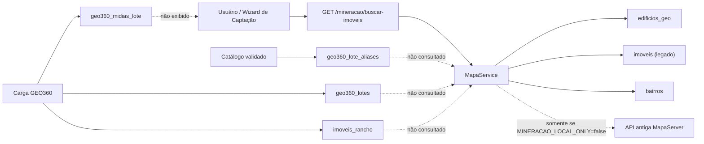
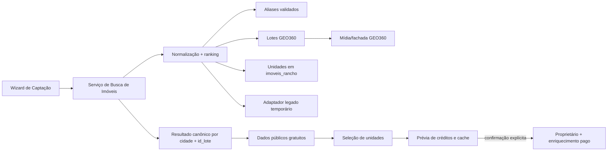

# Auditoria AS-IS/TO-BE — Busca de empreendimentos

Data: 23/07/2026  
Sistema auditado: ELYON em produção, commit `bd6818e`  
Profundidade: padrão, limitada ao fluxo de descoberta e seleção de imóveis  
Objetivo: definir a integração segura entre a busca da Captação, a base GEO360 e os aliases comerciais antes de implementar a mudança.

## Veredito executivo

A carga GEO360 e o catálogo de aliases estão tecnicamente disponíveis, mas ainda formam uma ilha de dados: o fluxo de Captação não os consulta. Em produção, `WISH VACA BRAVA` existe uma vez em `geo360_lote_aliases`, não existe em `edificios_geo` nem em `imoveis`, e por isso a busca atual retorna vazio.

A direção recomendada é criar uma camada única de descoberta que consulte GEO360 + aliases como fonte primária, mantenha o legado apenas como compatibilidade e separe explicitamente a exploração gratuita da etapa paga de identificação/enriquecimento do proprietário.

Confiança geral: **alta**. A conclusão combina comportamento observado em produção, consultas ao banco e inspeção do commit implantado. Não foram executadas ações de processamento pagas.

## Escopo e limites

Incluído:

- Entrada no Wizard de Captação.
- Busca por nome comercial.
- Resultado encontrado e seleção de empreendimento.
- Carregamento e seleção de unidades.
- Responsividade, clareza de cobrança e riscos de acessibilidade.
- Fontes de dados usadas pelo backend.

Não incluído:

- Execução de “Minerar Leads”, para evitar consumo de créditos.
- Avaliação completa das etapas Processar, Salvar e Concluir.
- Teste com leitor de tela real.
- Medição de contraste por ferramenta dedicada.

## Fluxo auditado

### 1. Entrada na Mineração — saúde: boa no desktop, ruim no mobile

O wizard comunica cinco etapas e oferece três modos de entrada: empreendimento, bairro/condomínio e IPTU. A ação “Abrir Mapa da Prefeitura” é útil, mas transfere o usuário para um sistema externo em vez de oferecer uma recuperação contextual dentro do Elyon.

Evidência: [04-mineracao-desktop-full.png](./04-mineracao-desktop-full.png)

### 2. Busca por “Wish Vaca Brava” — saúde: bloqueada

Após executar a busca, a interface retorna “Nenhum imóvel encontrado”. Não há erro de console. O estado vazio não oferece pesquisa por endereço, bairro, IPTU ou mapa; apenas “Tente outro termo”.

Evidência: [05-wish-sem-resultado.png](./05-wish-sem-resultado.png)

### 3. Busca por “IT FLAMBOYANT” — saúde: funcional, identidade insuficiente

A busca retorna um cartão com nome, tipo e endereço resumido. O usuário consegue avançar, mas não vê cidade, origem do dado, data de atualização, quantidade de unidades, nome oficial versus comercial ou imagem da fachada.

Evidência: [06-resultado-it-flamboyant.png](./06-resultado-it-flamboyant.png)

### 4. Seleção de unidades — saúde: funcional com risco de cobrança e acessibilidade

Foram carregadas 134 unidades. Todas as unidades, exceto BOX, são selecionadas automaticamente. A ação seguinte é “Minerar Leads (134)”, sem estimativa de créditos antes do clique. As linhas selecionáveis são elementos de tabela com `onClick`, sem foco por teclado, papel de checkbox, `aria-selected` ou nome acessível.

Evidência visual parcial: [07-selecao-unidades.png](./07-selecao-unidades.png)  
Limite: a captura desta etapa sofreu artefatos do navegador em elementos fixos; a estrutura, o conteúdo e os controles foram confirmados pelo DOM renderizado.

### 5. Reflow móvel — saúde: quebrada

Em viewport CSS de `390 × 844`, a página passou a ter `747 px` de largura rolável. O conteúdo principal começa fora da tela, exige rolagem horizontal e oculta contexto e ações.

Evidência: [08-unidades-mobile.png](./08-unidades-mobile.png)

## Registro de evidências

| ID | Classificação | Evidência | Fonte | Confiança |
|---|---|---|---|---|
| E01 | Fato | “Wish Vaca Brava” retorna zero resultados após busca explícita. | Produção + screenshot 05 | Alta |
| E02 | Fato | “IT FLAMBOYANT” retorna um edifício e carrega 134 unidades. | Produção + screenshot 06 + DOM | Alta |
| E03 | Fato | Produção contém 0 `edificios_geo` com WISH, 0 `imoveis` com WISH e 1 alias WISH. | Consulta PostgreSQL em produção | Alta |
| E04 | Fato | A rota `/mineracao/buscar-imoveis` chama `buscarEdificiosPorNome` e `buscarCondominiosHorizontais`. | `busca.rotas.ts:135-225` | Alta |
| E05 | Fato | `buscarEdificiosPorNome` consulta `prisma.edificio` e `prisma.imovel`, não `geo360LoteAlias`. | `mapa.ts:588-652` | Alta |
| E06 | Fato | O alias validado WISH está ligado ao lote 405683. | `geo360-aliases.ts:3-22` | Alta |
| E07 | Fato | As unidades GEO360 promovidas vivem em `imoveis_rancho`, agrupadas por cidade e `id_lote`. | `geo360-sync.ts:318-346`; `schema.prisma:1269-1313` | Alta |
| E08 | Fato | O código ainda contém fallback para a API antiga, mas o modo local é o padrão quando `MINERACAO_LOCAL_ONLY` não é `false`. | `mapa.ts:4-5`, `669-680` | Alta |
| E09 | Fato | Em produção, `MINERACAO_LOCAL_ONLY` não está definido; portanto a expressão do código ativa o modo local. | Ambiente do container + `mapa.ts:5` | Alta |
| E10 | Fato | A interface mostra estado vazio sempre que há termo e o array ainda está vazio, mesmo antes de distinguir “não pesquisado” de “pesquisado”. | `Captacao.tsx:1039-1052` | Alta |
| E11 | Fato | Linhas da tabela são selecionadas apenas por `onClick`; não têm semântica de controle. | `Captacao.tsx:1394-1407` + DOM | Alta |
| E12 | Fato | A etapa seleciona automaticamente todas as unidades não-BOX. | `Captacao.tsx:551-558` | Alta |
| E13 | Fato | O CTA pago não exibe estimativa; o processamento começa imediatamente e registra créditos apenas depois. | `Captacao.tsx:724-832`, `1451-1472` | Alta |
| E14 | Inferência | Usuários podem interpretar o zero resultado como inexistência do empreendimento, embora o dado exista em outra fonte interna. | E01 + E03–E07 | Alta |
| E15 | Desconhecido | Precisão e cobertura dos aliases após o primeiro cadastro validado. | Apenas um alias cadastrado | Alta |

## AS-IS

Consequência principal: atualizar GEO360 ou cadastrar um alias não altera o resultado da busca do usuário.

### Maturidade dos domínios relevantes

| Domínio | Nota | Confiança | Justificativa |
|---|---:|---|---|
| Dados | 2/5 | Alta | Fontes úteis e auditáveis existem, mas não há uma visão de leitura unificada nem ownership explícito da descoberta. |
| APIs e integrações | 2/5 | Alta | O contrato funciona para o legado, mas ignora GEO360/aliases e mantém código de fallback para API antiga. |
| UX e acessibilidade | 2/5 | Alta | Fluxo guiado e estados básicos existem; busca vazia, cobrança, teclado e mobile apresentam riscos materiais. |
| Governança e evolução | 3/5 | Média | Alias é versionado, validado e preserva o oficial; falta governança de consumo, ranking e qualidade. |
| Entrega e qualidade | 3/5 | Média | A alteração anterior passou por CI e deploy seguro, mas não há teste ponta a ponta garantindo descoberta via alias. |

## Achados priorizados

### [Alto/P1] GEO360 e aliases não participam da busca

- Impacto: empreendimentos válidos aparecem como inexistentes; o investimento na atualização da prefeitura não chega ao usuário.
- Causa: a rota de busca lê `edificios_geo`, `imoveis` e `bairros`, enquanto GEO360 usa `imoveis_rancho`, `geo360_lotes` e `geo360_lote_aliases`.
- Correção: introduzir um serviço de busca unificado com GEO360 como fonte primária.
- Aceite: “Wish Vaca Brava” retorna o lote 405683, sem chamada à API externa antiga, e permite listar suas unidades.

### [Alto/P1] Descoberta gratuita e enriquecimento pago não estão claramente separados

- Impacto: 134 unidades são pré-selecionadas e o CTA não informa custo estimado, fonte gratuita/cache ou quantidade que poderá gerar cobrança.
- Correção: separar “Ver dados públicos” de “Obter proprietários/contatos”; exibir estimativa, cache já disponível e teto de cobrança antes da confirmação.
- Aceite: nenhuma consulta paga ocorre antes de uma confirmação que mostre unidades elegíveis, gratuitas por cache, pagas e custo máximo.

### [Alto/P1] Seleção de unidades não é operável por teclado

- Impacto: usuários de teclado e tecnologias assistivas não conseguem alternar unidades individualmente.
- Correção: usar checkbox real com rótulo “Selecionar unidade {unidade/IPTU}”, foco visível e estado anunciado; manter o clique na linha apenas como conveniência.
- Aceite: fluxo completo operável por Tab, Espaço e Enter, sem depender do mouse.

### [Alto/P1] Layout móvel produz overflow horizontal severo

- Impacto: em 390 px, a largura rolável chega a 747 px e a tarefa fica parcialmente fora da tela.
- Correção: sidebar em drawer, conteúdo com `min-width: 0`, stepper compacto/rolável, filtros em uma coluna e tabela convertida em cartões ou rolagem contida.
- Aceite: em 320, 390 e 768 px, `scrollWidth <= clientWidth` no documento; todas as ações permanecem visíveis.

### [Médio/P2] Estado vazio aparece sem oferecer recuperação útil

- Impacto: o usuário recebe uma conclusão negativa sem saber se deve tentar nome oficial, endereço, IPTU ou mapa.
- Correção: controlar estado `idle | loading | success | empty | error`; no vazio oferecer “Buscar por endereço”, “Buscar por IPTU” e “Abrir mapa neste local”.
- Aceite: digitar sem submeter não mostra “Nenhum imóvel”; após zero real, são oferecidas rotas de recuperação.

### [Médio/P2] Cartão do resultado não reduz ambiguidade

- Impacto: empreendimentos homônimos ou endereços divergentes podem levar à seleção errada.
- Correção: exibir nome comercial, nome oficial, endereço oficial, bairro/cidade, fonte, última atualização, quantidade de unidades e foto principal quando disponível.
- Aceite: o usuário consegue distinguir resultados sem abrir o mapa externo.

## TO-BE recomendado

### Responsabilidades

1. **Serviço de Busca de Imóveis**
   - Normaliza caixa, acentos, prefixos como ED/RES/COND e tokens.
   - Consulta aliases validados, nome oficial, endereço e bairro GEO360.
   - Une legado apenas para itens ainda não migrados.
   - Deduplica por `cidade:id_lote`; no legado, usa uma referência tipada.
   - Classifica: alias exato > nome oficial exato > prefixo > endereço/bairro.

2. **Contrato canônico**
   - `ref`, `cidade`, `idLote`, `codigoLegado`.
   - `nomeExibicao`, `nomeOficial`, `aliases`.
   - `enderecoOficial`, `bairro`, `latitude`, `longitude`.
   - `totalUnidades`, `fotoPrincipal`, `fonte`, `atualizadoEm`.
   - `encontradoPor` e `confianca`.

3. **Consulta de unidades**
   - Para GEO360: `imoveis_rancho` por `cidade + id_lote`.
   - Para legado: adaptador atual enquanto necessário.
   - Não usar o `id_lote` como se fosse `codigoEdificio`; são identidades diferentes.

4. **Fronteira de cobrança**
   - Busca, endereço, dados cadastrais, unidades e foto: gratuitos.
   - Proprietário e contato: etapa paga separada.
   - Prévia obrigatória com cache/deduplicação e custo máximo.

## Decisões propostas

| ID | Decisão | Recomendação | Trade-off |
|---|---|---|---|
| ADR-01 | Fonte primária da descoberta | GEO360 + aliases validados | Exige adaptador temporário para legado. |
| ADR-02 | Identidade canônica | `cidade + id_lote` para GEO360 | O frontend precisa aceitar referência tipada, não apenas número. |
| ADR-03 | Persistência de nome comercial | Manter alias separado do oficial | Mais joins, porém preserva rastreabilidade. |
| ADR-04 | Compatibilidade | Strangler: serviço novo atrás da rota atual | Permite rollback e entrega incremental. |
| ADR-05 | API antiga | Mantê-la desativada e remover após paridade | Reduz fallback, mas exige observabilidade da cobertura local. |

## Roadmap

| Onda | Iniciativa | Esforço | Indicador | Exit criteria |
|---|---|---:|---|---|
| 1 — Contenção | Integrar aliases/lotes à rota existente e listar unidades de `imoveis_rancho`. | M | Busca WISH bem-sucedida | Lote 405683 e suas unidades retornam em produção. |
| 1 — Contenção | Corrigir estado `idle/empty` e oferecer recuperação por endereço/IPTU. | P | Zero falso vazio antes do submit | Estado vazio aparece somente após resposta zero. |
| 2 — Segurança comercial | Criar prévia de créditos e retirar seleção automática em massa ou exigir confirmação. | M | Zero cobranças sem confirmação | Auditoria registra confirmação e estimativa. |
| 2 — Acessibilidade | Checkboxes semânticos e correção do reflow móvel. | M | Teclado e 320/390/768 px aprovados | Sem overflow global; seleção operável por teclado. |
| 3 — Experiência completa | Cartões ricos com fonte, atualização, nome oficial/comercial e fachada. | M | Menor abandono/uso do mapa externo | Resultado distingue homônimos e endereços. |
| 4 — Desativação | Medir cobertura, remover caminhos da API antiga e consolidar métricas. | M | 100% das buscas servidas localmente | Sem chamadas à API antiga por período acordado. |

## Métricas de sucesso

- Taxa de busca com resultado por nome comercial.
- Taxa de recuperação por endereço/IPTU após zero resultado.
- Percentual de resultados originados em alias, nome oficial e legado.
- Latência p50/p95 da busca e da listagem de unidades.
- Percentual de consultas pagas atendidas por cache.
- Créditos previstos versus efetivamente cobrados.
- Zero overflow horizontal em breakpoints suportados.
- Zero violações críticas de teclado no fluxo.

## Próxima implementação recomendada

Começar pela Onda 1, preservando o endpoint atual e substituindo internamente a fonte de descoberta. O primeiro teste de aceitação deve ser “Wish Vaca Brava” → lote 405683 → unidades de `imoveis_rancho`, sem chamada à API antiga e sem consumir créditos.
