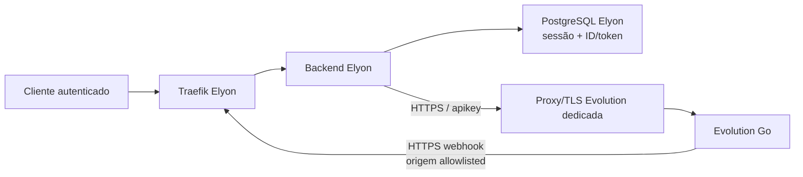

# Incidente pré-piloto — conexão Evolution Go

**Data da investigação:** 2026-07-15

**Escopo:** investigação read-only, correção local e testes; sem nova tentativa de conexão

**Classificação:** bloqueador pré-piloto; Issue #62 aberta; Onda 1 bloqueada

## Veredito executivo

A sessão reportada possui `evolutionInstanceId` e `evolutionToken` no banco Elyon,
mas a Evolution Go dedicada não possui a instância correspondente nem qualquer
outra instância. O backend, portanto, tratava metadados locais órfãos como prova
de existência remota e chamava `POST /instance/connect` com um token sem instância.

O estágio observado foi `instance/connect`. DNS, TLS, URL, chave global, banco e
URL pública do backend estavam operacionais. A resposta HTTP original da Evolution
não foi preservada pelo logger; uma consulta read-only posterior a
`GET /instance/status` com o token persistido retornou `401`. Não confundir esse
probe posterior com o status da chamada original.

**Confiança:** alta para a divergência banco/Evolution e para o estágio; média
para a causa do `401` original, pois o payload de erro adicional foi descartado
pelo bridge de console em produção.

## Evidências sanitizadas

| Classificação | Observação |
| --- | --- |
| Fato | Duas chamadas observadas em `2026-07-15 20:33:29` e `20:35:07` BRT registraram `[WhatsApp] Erro ao conectar instância` e `[SessoesWhatsapp] Erro ao conectar`. |
| Fato | Não houve, nas mesmas janelas, log de erro em `instance/create` ou `instance/qr`. |
| Fato | As respostas Elyon foram HTTP `500`; as durações preservadas foram 27,86 ms e 38,39 ms. O evento de aproximadamente 253 ms informado na reprodução não está no trecho preservado do container atual. |
| Fato | A sessão tinha ID e token Evolution presentes, sem que seus valores fossem expostos. |
| Fato | `GET /instance/all`, com chave global, retornou HTTP `200` e lista vazia. |
| Fato | `GET /instance/status`, com o token persistido, retornou HTTP `401`. |
| Fato | O estado local ficou indevidamente `CONECTANDO` após cada HTTP `500` e só foi reconciliado para `DESCONECTADO` pelo polling cerca de 5 s e 2 s depois. No fim da investigação estava `DESCONECTADO`. |
| Fato | `EVOLUTION_API_URL`, `EVOLUTION_API_KEY` e `BACKEND_URL` estavam presentes; `BACKEND_URL` correspondia à URL pública esperada. |
| Fato | DNS e handshake TLS da Evolution funcionaram; `HEAD /` retornou `404`, coerente com uma raiz sem handler. |
| Fato | `GET /server/ok` retornou `200`/`status=ok`; `GET /license/status` retornou `200`/`status=active`. |
| Fato | Backend em execução: imagem `elyon-backend:latest`, image ID abreviado `sha256:850f126dc601`, marcador de deploy `0b981a1b8702`. |
| Desconhecido | Imagem, digest e commit exatos da Evolution dedicada. O SSH chega ao host, mas a chave disponível não é autorizada; a API não expõe esses metadados. |
| Desconhecido | Status e corpo exatos retornados por `POST /instance/connect` na tentativa original, devido à perda do segundo argumento do `console.error`. |
| Inferência | A chamada original foi rejeitada por credencial órfã ou instância ausente; o `401` posterior e a lista vazia sustentam a hipótese, mas não recuperam o response original. |

## Resultado solicitado

| Item | Resultado |
| --- | --- |
| Estágio que falhou | `instance/connect` |
| Status HTTP original da Evolution | Desconhecido; não persistido. Probe read-only posterior: `401`. |
| Reason code sanitizado | Original: desconhecido. Diagnóstico posterior: `EVOLUTION_AUTH_REJECTED`; causa estrutural: instância remota ausente. |
| Rota remota | `POST /instance/connect` |
| Instância já existia | Metadados locais: sim. Evolution Go: não. |
| `evolutionInstanceId` presente | Sim |
| `evolutionToken` presente | Sim |
| Sessão ficou em `CONECTANDO` | Sim, temporariamente e de forma indevida; estado final observado: `DESCONECTADO`. |

## Contrato observado da Evolution Go

A fonte de verdade operacional disponível é `GET /swagger/doc.json` na própria
Evolution dedicada. Ela se identifica como `Evolution GO`, versão Swagger `1.0`,
e lista as rotas abaixo.

### Fluxo e payloads

1. `POST /instance/create`
   - autenticação usada pelo Elyon: header `apikey` com chave global;
   - body observado no schema: `name`, `token`, `instanceId`, `advancedSettings`,
     `proxy`;
   - o Elyon envia `name`, `token` e `advancedSettings.ignoreGroups=true`.
2. `POST /instance/connect`
   - autenticação usada pelo Elyon: header `apikey` com token individual;
   - body do schema implantado: `immediate`, `natsEnable`, `phone`,
     `rabbitmqEnable`, `subscribe`, `webhookUrl`, `websocketEnable`;
   - o Elyon envia `webhookUrl` e `subscribe=[MESSAGE, CONNECTION, QRCODE]`.
3. `GET /instance/qr`
   - autenticação usada pelo Elyon: token individual;
   - o adaptador aceita `data.Qrcode` ou `data.qrcode` e `data.Code` ou
     `data.code`. QR e base64 nunca devem ser registrados.
4. `GET /instance/status`
   - autenticação usada pelo Elyon: token individual;
   - o adaptador lê `data.Connected`, `data.LoggedIn` e `data.Name`.
5. `DELETE /instance/delete/{instanceId}`
   - autenticação usada pelo Elyon: chave global;
   - `404` é tratado como exclusão idempotente.

O Swagger implantado não declara `securityDefinitions` nem segurança por operação;
portanto ele documenta payload/rotas, mas não é fonte suficiente para a matriz de
autenticação.

### Matriz de autenticação

| Endpoint | Chave global | Token individual | Evidência |
| --- | --- | --- | --- |
| `GET /instance/all` | Obrigatória | Não aceito | Probe direto: global `200`, sem chave `401`; não havia token remoto válido para um terceiro probe. |
| `POST /instance/create` | Usada/esperada | Não | Código Elyon e separação administrativa do contrato. |
| `DELETE /instance/delete/{id}` | Usada/esperada | Não | Código Elyon e separação administrativa do contrato. |
| `POST /instance/connect` | Não | Usado/esperado | Código Elyon; tentativa original não preservou status upstream. |
| `GET /instance/qr` | Não | Usado/esperado | Código Elyon; endpoint não foi chamado durante a investigação para evitar produzir QR. |
| `GET /instance/status` | Não | Usado/esperado | Probe com token órfão retornou `401`; não havia instância válida para teste positivo. |
| `DELETE /instance/logout` | Não | Usado/esperado | Código Elyon. |

**Compatibilidade de tokens antigos:** inconclusiva. A Evolution não possuía
nenhuma instância, então não havia token antigo válido para teste positivo. O
backend corrigido reaproveita o token local ao recriar uma instância órfã e adota
o token retornado por `/instance/all` quando a instância existe; isso cobre os
dois formatos sem revelar credenciais.

### Exemplos curl sanitizados

```bash
# Administração — nunca cole a chave em issue ou log
curl -sS -H 'apikey: <GLOBAL_KEY>' '<EVOLUTION_URL>/instance/all'

curl -sS -X POST \
  -H 'Content-Type: application/json' \
  -H 'apikey: <GLOBAL_KEY>' \
  -d '{"name":"elyon_<tenant>_<slug>","token":"<INSTANCE_TOKEN>","advancedSettings":{"ignoreGroups":true}}' \
  '<EVOLUTION_URL>/instance/create'

# Operação da instância
curl -sS -X POST \
  -H 'Content-Type: application/json' \
  -H 'apikey: <INSTANCE_TOKEN>' \
  -d '{"webhookUrl":"<BACKEND_URL>/webhooks","subscribe":["MESSAGE","CONNECTION","QRCODE"]}' \
  '<EVOLUTION_URL>/instance/connect'

# Não imprima a resposta deste endpoint em terminal compartilhado
curl -sS -H 'apikey: <INSTANCE_TOKEN>' '<EVOLUTION_URL>/instance/qr'

curl -sS -H 'apikey: <INSTANCE_TOKEN>' '<EVOLUTION_URL>/instance/status'

curl -sS -X DELETE -H 'apikey: <GLOBAL_KEY>' \
  '<EVOLUTION_URL>/instance/delete/<INSTANCE_ID>'
```

## SOP operacional

1. **Criar:** confirme a inexistência por nome em `/instance/all`; crie com chave
   global; valide presença de ID/token na resposta; persista ambos atomicamente.
2. **Conectar:** confirme que a instância remota ainda existe; reconcilie ID/token
   quando necessário; marque localmente `CONECTANDO`; chame `/instance/connect`.
3. **QR:** somente após connect bem-sucedido, leia `/instance/qr`; nunca registre
   QR, code ou base64; entregue apenas ao cliente autenticado do tenant.
4. **Status:** leia `/instance/status` com token individual e traduza
   `Connected/LoggedIn` para os estados canônicos Elyon.
5. **Falha pré-QR:** restaure `DESCONECTADO`; registre estágio, rota, status
   upstream, reason code seguro e correlation ID.
6. **Excluir:** use ID e chave global; aceite `404` como idempotente; só remova o
   registro local após sucesso/404 remoto.

## Topologia AS-IS



A Evolution Go não faz parte do Compose Elyon. O proxy/TLS da Evolution é externo
ao host Elyon; detalhes internos adicionais não puderam ser confirmados sem acesso
SSH autorizado ao host dedicado.

## Documentos e lacunas de governança

Documentos Elyon existentes:

- `docs/operacao/RETIRADA_EVOLUTION_API_LEGADA.md`: retirada, backup e rollback
  da Evolution API local aposentada;
- `docs/operacao/WEBHOOKS_SEGUROS.md`: topologia, autenticação inbound e rollback
  do webhook;
- `docs/guias/MIGRACAO.md`: preservação da URL, chave global e tokens individuais;
- `docs/operacao/RUNBOOK_OPERACIONAL.md`: deploy/rollback do Elyon;
- `docs/operacao/BACKUP_OFFHOST_E_RESTORE.md`: backup e restore do Elyon.

Não foram encontrados no repositório Elyon nem disponibilizados pelo host dedicado:

- relatório das alterações diretas feitas na Evolution Go;
- commit/digest da imagem Evolution implantada;
- changelog específico do deployment;
- backup/restore drill e rollback testado da Evolution dedicada;
- matriz de autenticação oficial e completa por endpoint.

O changelog público do projeto Evolution Go é referência upstream, não prova do
artefato implantado. Antes de desbloquear o piloto, o owner da Evolution dedicada
deve fornecer commit/digest, diff de customizações, changelog de deploy, backup
verificado e rollback ensaiado.

## Correção implementada no Elyon

- verifica se a instância remota existe mesmo quando ID/token locais estão presentes;
- recria instância órfã usando o token persistido e adota credenciais atuais quando
  a instância remota existe;
- classifica falha upstream respondida como `502` e indisponibilidade como `503`;
- retorna `reasonCode`, `stage`, `upstreamStatus`, `upstreamRoute` e correlation ID
  sem expor credenciais;
- restaura `DESCONECTADO` em falha anterior ao QR;
- registra campos estruturados e sanitizados nos quatro estágios relevantes;
- coalesce requisições concorrentes de conexão por instância e libera o lock ao
  final, permitindo retry sem criar uma segunda instância;
- cobre por teste instância nova, existente, órfã, token inválido, Evolution
  indisponível, mudança de contrato, concorrência, retry e rollback do estado.

### Evidências de validação

- build TypeScript: aprovado;
- testes focados: 13 aprovados;
- suíte unitária completa: 96 suites e 909 testes aprovados;
- lint dos três arquivos novos TypeScript: aprovado sem erro ou warning;
- arquivos legados modificados: nenhum erro ESLint novo nas linhas do delta;
- `git diff --check`: aprovado;
- `docker compose --env-file .env.production.example config --quiet`: aprovado,
  apenas com warnings de placeholders opcionais ausentes;
- gate ESLint global: permanece reprovado por 62 erros e 969 warnings
  preexistentes. A ocorrência no arquivo de rota modificado está fora dos hunks
  desta correção e já existe em `origin/main`. O legado de lint não faz parte
  deste incidente.

## Rollout e rollback

Após aprovação: merge, CI de `main`, deploy, validação de backend e worker,
confirmação do estado inicial `DESCONECTADO` e probe administrativo read-only.
Somente depois dessas etapas deve ser solicitada autorização explícita para uma
única tentativa controlada de conexão.

Rollback: reimplantar o SHA anterior do backend. Não apagar sessões ou
credenciais manualmente e não executar faxina remota automática sem relatório
dry-run revisado.

## Restrições preservadas

Nenhuma flag da Issue #62 foi alterada. No container observado as duas flags não
estavam com valor `true`, portanto o comportamento efetivo permaneceu desabilitado
por fail-closed. Permanecem como configuração requerida:

```dotenv
AGENDA_EFFECTS_ENABLED=false
AGENDA_NO_SHOW_ENABLED=false
AGENDA_PILOT_TENANT_ID=
AGENDA_PILOT_STARTED_AT=
AGENDA_NO_SHOW_GRACE_MINUTES=
```

A Issue #62 deve permanecer aberta e a Onda 1 bloqueada até deploy da correção,
validação controlada única e entrega das evidências ausentes da Evolution dedicada.
